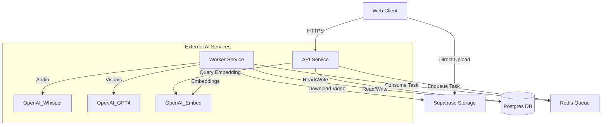

# Architecture & Codebase Overview

This document provides a comprehensive overview of the Heimdex repository. It is intended for new contributors and serves as a reference for the system's architecture, design decisions, and key workflows.

## 1. Repository Overview

Heimdex is a vector-native video archive and search platform. It allows users to upload videos, which are automatically processed to extract metadata, transcribe audio, and analyze visual content. The system generates embeddings for each scene, enabling natural language semantic search across the video library.

The repository is structured as a **monorepo** containing the backend API, background worker, frontend application, and shared libraries.

## 2. Tech Stack & Dependencies

### Core Technologies
*   **Language**: Python 3.11 (Backend/Worker), TypeScript (Frontend).
*   **Backend Framework**: FastAPI (Async Python web framework).
*   **Frontend Framework**: Next.js 14 (React 18, App Router).
*   **Database**: PostgreSQL (via Supabase) with `pgvector` extension.
*   **Auth & Storage**: Supabase (Auth, Storage Buckets).
*   **Queue/Messaging**: Redis + Dramatiq.
*   **AI/ML**:
    *   **OpenAI GPT-4o**: For visual analysis of video frames.
    *   **OpenAI Whisper**: For audio transcription.
    *   **OpenAI text-embedding-3**: For generating vector embeddings.
    *   **PySceneDetect**: For splitting videos into scenes.
    *   **FFmpeg**: For video metadata and frame extraction.

### Key Libraries
*   **Backend**: `pydantic` (validation), `supabase-py` (DB client), `dramatiq` (task queue), `opencv-python` (image processing).
*   **Frontend**: `tailwindcss` (styling), `@supabase/supabase-js` (auth/client).

## 3. Project Structure

```
.
├── .github/                # CI/CD workflows (GitHub Actions)
├── docs/                   # Documentation
├── infra/                  # Infrastructure configuration
│   └── migrations/         # SQL migrations for Supabase/Postgres
├── libs/                   # Shared Python libraries
│   └── tasks/              # Shared Dramatiq task definitions
├── services/               # Main application services
│   ├── api/                # FastAPI backend service
│   ├── frontend/           # Next.js frontend application
│   └── worker/             # Background processing worker
├── docker-compose.yml      # Local development orchestration
└── pyproject.toml          # (Root) May exist, but services have their own deps
```

### Key Directories
*   **`services/api`**: REST API handling user requests, search, and video management.
*   **`services/worker`**: Heavy lifting—video processing, AI analysis, embedding generation.
*   **`services/frontend`**: The user interface.
*   **`libs/tasks`**: Contains the "Actor" definitions (signatures) for Dramatiq tasks. This decouples the API (producer) from the Worker (consumer) so the API doesn't need heavy dependencies like PyTorch or OpenCV just to enqueue a job.

## 4. Application Architecture

The system follows a **Service-Oriented Architecture (SOA)** with a decoupled background worker pattern.

### High-Level Data Flow
1.  **Upload**: User requests an upload URL from **API** -> Uploads file directly to **Supabase Storage** -> Notifies **API** of completion.
2.  **Queue**: **API** pushes a `process_video` job to **Redis** (Dramatiq).
3.  **Process**: **Worker** picks up the job -> Downloads video -> Splits into scenes -> Transcribes (Whisper) -> Analyzes visuals (GPT-4o) -> Generates Embeddings.
4.  **Persist**: Metadata and Embeddings are saved to **PostgreSQL**.
5.  **Search**: User queries **Frontend** -> **API** converts query to vector -> **PostgreSQL** performs cosine similarity search -> Results returned.



## 5. Backend / Services

### API Service (`services/api`)
*   **Entrypoint**: `src/main.py`
*   **Responsibilities**:
    *   **Auth**: Verifies Supabase JWT tokens via middleware.
    *   **Videos**: Generates signed upload URLs, tracks video status.
    *   **Search**: Converts text queries to embeddings and calls the DB search RPC.
*   **Key Modules**:
    *   `adapters/database.py`: Abstraction over Supabase/Postgres interactions.
    *   `adapters/queue.py`: Wraps `libs.tasks.process_video.send()`.
    *   `routes/`: FastAPI routers for `videos`, `search`, `profile`.

### Worker Service (`services/worker`)
*   **Entrypoint**: `src/tasks.py` (Dramatiq loader)
*   **Responsibilities**: Asynchronous video processing pipeline.
*   **Pipeline (`domain/video_processor.py`)**:
    1.  **Metadata**: Extract duration, resolution, fps.
    2.  **Scene Detection**: Use `scenedetect` to find cuts.
    3.  **Transcription**: Extract audio -> Whisper API.
    4.  **Parallel Processing**:
        *   Extract keyframes.
        *   Select best frame (sharpness/quality check).
        *   **Visual Analysis**: Send frame to GPT-4o for description.
        *   **Sidecar Build**: Combine Visual + Audio + Metadata text.
        *   **Embedding**: Generate vector for combined text.
        *   **Save**: Write `VideoScene` to DB.

## 6. Frontend / Client

The frontend is a **Next.js 14** application located in `services/frontend`.

*   **Routing**: Uses the App Router (`src/app`).
    *   `/dashboard`: List of user videos.
    *   `/videos/[id]`: Detailed view of a video and its scenes.
    *   `/upload`: Video upload interface.
    *   `/search`: Semantic search interface.
*   **Auth**: Client-side authentication using `@supabase/supabase-js`. The session token is sent to the API in the `Authorization` header.
*   **State**: Mostly server components or local React state. Uses a custom `apiRequest` utility (`lib/supabase.ts`) to handle authenticated fetch calls.

## 7. Data & Storage Layer

### Database (PostgreSQL via Supabase)
Schema definition is found in `infra/migrations/`.

**Core Entities**:
*   **`user_profiles`**: Extended user data linked to `auth.users`.
*   **`videos`**: Metadata (path, duration, status, owner).
*   **`video_scenes`**: Granular scene data.
    *   `embedding`: `vector(1536)` column for semantic search.
    *   `combined_text`: The actual text used to generate the embedding.
*   **`search_queries`**: Analytics log of user searches.

**Vector Search**:
*   Uses `pgvector` with an **HNSW index** for performance.
*   Search logic is encapsulated in a Postgres function: `search_scenes_by_embedding`. This function handles cosine similarity calculation and filtering by user ownership.

### Object Storage
*   **Supabase Storage Bucket**: `videos`
*   **Structure**: `{user_id}/{video_id}.{ext}`
*   Thumbnails are also stored here.

## 8. Background Jobs & Queues

*   **Implementation**: **Dramatiq** with **Redis** broker.
*   **Decoupling**:
    *   The shared task signature lives in `libs/tasks/video_processing.py`.
    *   The API imports this *definition* to send messages.
    *   The Worker imports this and *implements* the logic (using lazy imports for heavy dependencies).
*   **Concurrency**:
    *   Worker processes scenes in parallel threads (`ThreadPoolExecutor`) to speed up IO-bound AI calls.
    *   Rate limiting is handled via semaphores to avoid hitting OpenAI limits.

## 9. Configuration & Environment Variables

Configuration is managed via environment variables. See `.env.example`.

**Critical Variables**:
*   `SUPABASE_URL`, `SUPABASE_SERVICE_ROLE_KEY`: For backend admin access.
*   `DATABASE_URL`: Direct Postgres connection string.
*   `OPENAI_API_KEY`: For AI services.
*   `REDIS_URL`: For the job queue.

**Local Development**:
1.  Set up `.env` from example.
2.  Run `docker-compose up --build`.
3.  Access Frontend at `http://localhost:3000`, API at `http://localhost:8000`.

## 10. Testing & Quality Assurance

*   **Current State**: Testing is sparse.
    *   `test_storage.py`: Script to verify Supabase storage connectivity.
    *   `services/worker/test_metadata.py`: Unit test for sidecar text generation.
*   **CI/CD**: GitHub Actions (`.github/workflows`) are configured to:
    *   Lint Python (Ruff) and TypeScript (ESLint).
    *   Validate Docker builds.

## 11. Observed Anti-patterns / Risks

*   **Testing Gap**: There is a lack of comprehensive unit or integration tests for the core API endpoints and worker pipeline. Refactoring carries high risk without these.
*   **Error Handling**: If a scene processing fails, the system logs it but tries to continue. This is generally good for resilience but might lead to incomplete video data without clear user feedback (though `FAILED` status exists for total failure).
*   **Database Logic**: Some business logic (like search filtering and similarity math) lives in SQL functions (`search_scenes_by_embedding`). This is performant but splits logic between Python and SQL.

## 12. Questions / Ambiguities

*   **Retries**: Dramatiq is configured with retries, but it's unclear how partial failures (e.g., 5 out of 10 scenes processed) are handled on a job retry. Does it re-process everything? (Code suggests it checks for existing scenes to skip them, which implies idempotency is handled).
*   **Cleanup**: There doesn't appear to be an automatic cleanup for files in `tmp/heimdex` if the worker crashes hard before the `finally` block executes, though Docker container restarts would clear it.
