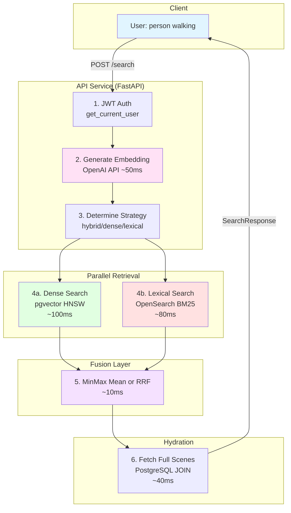
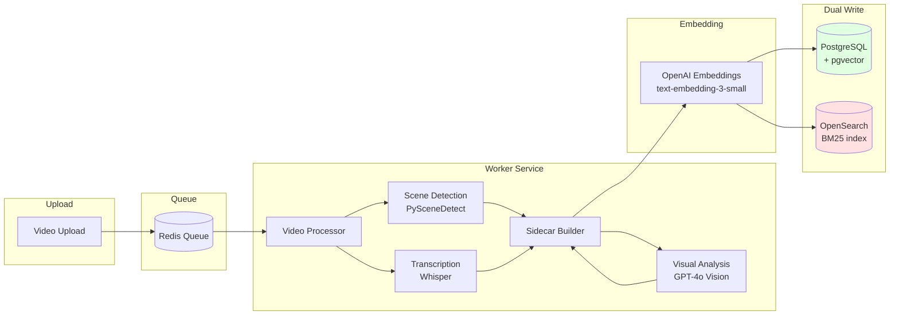

# Heimdex Search Pipeline Deep Dive

**Last Updated:** 2025-12-15
**Status:** Production
**Companion Document:** [Search Pipeline](./search-pipeline.md) (primary documentation)

---

## Executive Summary (60-Second Orientation)

Heimdex is a **video scene search platform** that uses hybrid retrieval:

1. **Dense Vector Search** (pgvector/PostgreSQL): Semantic similarity via OpenAI `text-embedding-3-small` embeddings
2. **Lexical BM25 Search** (OpenSearch): Keyword matching with Korean (nori) and English analyzers
3. **Fusion**: Results combined via Min-Max Weighted Mean (default) or Reciprocal Rank Fusion (RRF)

**Query flow**: User query → embedding generation → parallel retrieval (dense + lexical) → fusion → hydration → response

**Indexing flow**: Video upload → scene detection → transcription → visual analysis → embedding → dual-write (PG + OpenSearch)

This document provides **implementation-level detail** beyond the primary [Search Pipeline](./search-pipeline.md) doc, focusing on:
- Exhaustive scoring signal tables
- Timeout and cancellation semantics
- Gap analysis and prioritized improvements
- Complete code pointer index

---

## Architecture Diagrams

### Query Flow



### Indexing Flow



---

## Entry Points

### REST API Endpoints

| Endpoint | Method | Handler | File | Line |
|----------|--------|---------|------|------|
| `/search` | POST | `search_scenes()` | `services/api/src/routes/search.py` | 193 |

### Frontend Call Path

```
SearchPage.tsx:handleSearch()
  → apiRequest<SearchResult>('/search', { method: 'POST', body: {...} })
    → services/api/src/routes/search.py:search_scenes()
```

**File:** `services/frontend/src/app/search/page.tsx:31-55`

### Authentication Flow

1. **JWT Extraction**: `services/api/src/auth.py:get_current_user()`
2. **User ID Derivation**: JWT `sub` claim → `user_id: UUID`
3. **Ownership Verification**: If `video_id` provided, check `video.owner_id == user_id`

### Multi-Tenant Isolation

| System | Isolation Mechanism | Code Pointer |
|--------|---------------------|--------------|
| **PostgreSQL** | RLS Policy: `auth.uid() = owner_id` | `infra/migrations/001_initial_schema.sql:115-141` |
| **PostgreSQL (RPC)** | `filter_user_id` param → `WHERE v.owner_id = filter_user_id` | `infra/migrations/007_add_user_filter_to_search.sql:42` |
| **OpenSearch** | `{"term": {"owner_id": user_id}}` filter in every query | `services/api/src/adapters/opensearch_client.py:226` |

**Invariant**: Every search query MUST include user_id filtering. No code path allows cross-tenant data access.

---

## Modalities: What Features Contribute to Search

### Scoring Signal Table

| Signal Name | Source System | Raw Score Scale | Normalization | Default Weight | Code Pointer |
|-------------|---------------|-----------------|---------------|----------------|--------------|
| **Dense (cosine similarity)** | PostgreSQL pgvector | [0.0, 1.0] | Already normalized | 0.7 (MinMax) | `services/api/src/routes/search.py:48-78` |
| **Lexical (BM25)** | OpenSearch | [0, ∞) typical 5-50 | MinMax → [0, 1] | 0.3 (MinMax) | `services/api/src/adapters/opensearch_client.py:201-297` |
| **tags_text** | OpenSearch | BM25 subcomponent | Part of lexical | Boost: 4x | `opensearch_client.py:243-245` |
| **transcript_segment** | OpenSearch | BM25 subcomponent | Part of lexical | Boost: 3x | `opensearch_client.py:247-249` |
| **visual_description** | OpenSearch | BM25 subcomponent | Part of lexical | Boost: 2x | `opensearch_client.py:251-253` |
| **visual_summary** | OpenSearch | BM25 subcomponent | Part of lexical | Boost: 2x | `opensearch_client.py:255-257` |
| **combined_text** | OpenSearch | BM25 subcomponent | Part of lexical | Boost: 1x | `opensearch_client.py:259-261` |

### Modality Details

#### A. Transcript Semantics (ASR)

**What it represents**: Speech-to-text content from video audio

**Indexing-time production**:
- **Worker function**: `services/worker/src/adapters/openai_client.py:transcribe_audio_with_quality()`
- **Model**: OpenAI Whisper
- **Input**: Extracted audio track from video
- **Heuristics**: Quality filtering (`no_speech_prob > 0.8` → treat as no speech)
- **Config**: `services/worker/src/config.py:84-94`

**Storage**:
- PostgreSQL: `video_scenes.transcript_segment` (TEXT)
- OpenSearch: `transcript_segment` + `.ko` + `.en` subfields

**Query-time usage**:
- Dense: Part of `search_text` → embedded → cosine similarity
- Lexical: BM25 with boost 3x across all language variants

#### B. Visual Semantics

**What it represents**: AI-generated descriptions, entities, and actions from keyframes

**Indexing-time production**:
- **Worker function**: `services/worker/src/adapters/openai_client.py:analyze_scene_visuals_optimized()`
- **Model**: GPT-4o Vision (configurable: `visual_semantics_model`)
- **Input**: Best quality keyframe from scene (brightness/blur filtered)
- **Heuristics**: Skip if scene < 1.5s AND transcript > 50 chars (cost optimization)
- **Config**: `services/worker/src/config.py:46-67`

**Storage**:
- PostgreSQL: `visual_description`, `visual_entities[]`, `visual_actions[]`, `tags[]`
- OpenSearch: Same fields with multi-language subfields

**Query-time usage**:
- Dense: `visual_description` part of `search_text` → embedded
- Lexical: `visual_description` (2x), `tags_text` (4x)

#### C. Combined/Search Text

**What it represents**: Optimized text blob for embedding generation

**Indexing-time production**:
- **Worker function**: `services/worker/src/domain/sidecar_builder.py:_build_search_text()`
- **Strategy**: Transcript-first (highest signal-to-noise), visual-description second
- **Max length**: 8000 chars (`search_text_max_length`)

**Storage**:
- PostgreSQL: `search_text` (v2), `combined_text` (v1 legacy)
- OpenSearch: `combined_text` with subfields

**Query-time usage**:
- Dense: Embedding generated from this text
- Lexical: BM25 with boost 1x (lowest, as it's redundant with other fields)

#### D. Tags

**What it represents**: Normalized keywords from entities + actions

**Indexing-time production**:
- **Worker function**: `services/worker/src/domain/sidecar_builder.py` (tag normalization)
- **Source**: `visual_entities` + `visual_actions` → lowercase, deduplicated
- **Format**: Array of strings

**Storage**:
- PostgreSQL: `tags[]` (TEXT ARRAY) with GIN index
- OpenSearch: `tags` (keyword array) + `tags_text` (space-joined for BM25)

**Query-time usage**:
- Dense: Not directly used (entities/actions already in visual_description)
- Lexical: `tags_text` with boost 4x (highest, curated keywords)

---

## Retrieval Orchestration & Concurrency

### Parallel Execution

**Mechanism**: `concurrent.futures.ThreadPoolExecutor(max_workers=2)`

**Code**: `services/api/src/routes/search.py:304-331`

```python
with ThreadPoolExecutor(max_workers=2) as executor:
    futures = {
        executor.submit(_run_dense_search, ...): "dense",
        executor.submit(_run_lexical_search, ...): "lexical",
    }
    for future in as_completed(futures):
        # Collect results as they complete
```

### Timeout Behavior Per Component

| Component | Timeout | Configured In | Behavior on Timeout |
|-----------|---------|---------------|---------------------|
| **OpenAI Embedding API** | Network default (~60s) | Not explicitly configured | Exception → `embedding_failed=True` → lexical-only fallback |
| **PostgreSQL (pgvector)** | Connection pool default | Supabase SDK | Exception → logged, search fails |
| **OpenSearch** | 1.0s (query), 2.0s (indexing) | `services/api/src/config.py:37` / `services/worker/src/config.py:79` | Returns empty list, search continues in dense-only mode |
| **ThreadPoolExecutor** | None (waits indefinitely) | N/A | No timeout; relies on underlying system timeouts |

### Cancellation Logic

**Current behavior**: If one retrieval fails, the other continues

```python
for future in as_completed(futures):
    search_type = futures[future]
    try:
        if search_type == "dense":
            dense_candidates, dense_ms = future.result()
        else:
            lexical_candidates, lexical_ms = future.result()
    except Exception as e:
        logger.error(f"{search_type} search failed: {e}")
        # Continue processing - graceful degradation
```

**Code**: `services/api/src/routes/search.py:323-331`

**Note**: No explicit cancellation. Both futures run to completion even if one fails early.

### Error Handling and Fallback Modes

| Scenario | Fallback Mode | Score Type | Code Pointer |
|----------|---------------|------------|--------------|
| Both succeed | Hybrid | `minmax_mean` or `rrf` | `search.py:300-348` |
| OpenSearch unavailable | Dense-only | `dense_only` | `search.py:367-383` |
| Embedding fails, OS available | Lexical-only | `lexical_only` | `search.py:350-365` |
| Both fail | HTTP 500 | N/A | `search.py:385-390` |

---

## Fusion / Scoring / Ranking

### Fusion Method Selection

**Runtime determination**: `services/api/src/routes/search.py:239-241`

```python
fusion_method = request.fusion_method or settings.fusion_method
weight_dense = request.weight_dense if request.weight_dense is not None else settings.fusion_weight_dense
weight_lexical = request.weight_lexical if request.weight_lexical is not None else settings.fusion_weight_lexical
```

### Min-Max Weighted Mean (Default)

**Formula**:
```
dense_norm = (dense_score - min_dense) / (max_dense - min_dense + eps)
lexical_norm = (lexical_score - min_lexical) / (max_lexical - min_lexical + eps)
final_score = w_dense × dense_norm + w_lexical × lexical_norm
```

**Code**: `services/api/src/domain/search/fusion.py:133-251`

### Reciprocal Rank Fusion (RRF)

**Formula**:
```
RRF_score(scene) = Σ [ 1 / (k + rank_i) ]  for i ∈ {dense, lexical}
```

**Code**: `services/api/src/domain/search/fusion.py:254-352`

### Tie-Breaking

```python
def sort_key(candidate: FusedCandidate) -> tuple:
    return (
        -candidate.score,           # 1. Higher score first
        candidate.dense_rank or inf, # 2. Better dense rank
        candidate.lexical_rank or inf, # 3. Better lexical rank
        candidate.scene_id,          # 4. Stable tiebreaker
    )
```

**Code**: `fusion.py:241-248` (MinMax), `fusion.py:342-348` (RRF)

### Deduplication

**Implicit**: Scene IDs are unique. Union of dense and lexical results creates a set.

**Code**: `fusion.py:211` (MinMax), `fusion.py:298` (RRF)
```python
all_ids = set(dense_by_id.keys()) | set(lexical_by_id.keys())
```

### Ordering Preservation in Hydration

**Mechanism**: `preserve_order=True` in `get_scenes_by_ids()`

**Code**: `services/api/src/adapters/database.py:415-465`

```python
if preserve_order:
    result = []
    for sid in scene_ids:
        scene = scenes_by_id.get(str(sid))
        if scene:
            result.append(scene)
    return result
```

---

## Index Definitions, Migrations, and Invariants

### pgvector Index (HNSW)

```sql
CREATE INDEX idx_video_scenes_embedding ON video_scenes
USING hnsw (embedding vector_cosine_ops)
WITH (m = 16, ef_construction = 64);
```

**File**: `infra/migrations/002_enable_pgvector.sql:14-16`

**Parameters**:
- `m = 16`: Max edges per graph node (recall vs memory tradeoff)
- `ef_construction = 64`: Search depth during index build

### Stored Procedure

```sql
CREATE OR REPLACE FUNCTION search_scenes_by_embedding(
    query_embedding vector(1536),
    match_threshold float DEFAULT 0.5,
    match_count int DEFAULT 10,
    filter_video_id uuid DEFAULT NULL,
    filter_user_id uuid DEFAULT NULL
) RETURNS TABLE (...)
```

**File**: `infra/migrations/007_add_user_filter_to_search.sql:4-48`

**Called from**: `services/api/src/adapters/database.py:412`

### OpenSearch Index Mapping

**File**: `services/api/src/adapters/opensearch_client.py:18-95` (API)
**File**: `services/worker/src/adapters/opensearch_client.py:18-95` (Worker)

**Analyzers**:
- `ko_nori`: Korean morphological analysis via nori_tokenizer
- `en_english`: English stemming and stop words

### Invariants

| Invariant | Enforcement | Code Pointer |
|-----------|-------------|--------------|
| Scene ID uniqueness | PostgreSQL: `UNIQUE(video_id, index)` | `001_initial_schema.sql:75` |
| Embedding dimension | `vector(1536)` type constraint | `002_enable_pgvector.sql:8` |
| User ownership | RLS policies, application filtering | `001_initial_schema.sql:115-141` |
| Idempotent OpenSearch upsert | `scene_id` as document ID | `worker/opensearch_client.py:218-220` |

---

## Observability & Debugging

### Log Points

| Log Level | Content | File |
|-----------|---------|------|
| INFO | Search request details (user, query, mode, weights) | `search.py:251-256` |
| INFO | Search completion (mode, results count, latency breakdown) | `search.py:414-421` |
| DEBUG | BM25 result count | `opensearch_client.py:289` |
| WARNING | OpenSearch unavailable | `opensearch_client.py:220` |
| ERROR | Retrieval failures | `search.py:331` |

### Deterministic Debug Checklist

1. **Verify search mode**: Check logs for `mode=hybrid|dense|lexical`
2. **Verify dense candidates**: Check `dense_candidates=X` in logs
3. **Verify lexical candidates**: Check `lexical_candidates=Y` in logs
4. **Verify fusion inputs**: Enable `SEARCH_DEBUG=true` for raw/norm scores in response
5. **Verify final ordering**: Check `similarity` field in response (this is the fused score)

### Reproduction Steps (Local)

```bash
# 1. Verify OpenSearch is up
curl http://localhost:9200/_cluster/health

# 2. Verify index exists
curl http://localhost:9200/scene_docs/_count

# 3. Run smoke test
docker-compose exec api python -m src.scripts.smoke_hybrid_search \
  --query "person walking" --owner-id <user-id> --verbose

# 4. Manual search with debug
curl -X POST http://localhost:8000/api/search \
  -H "Authorization: Bearer <jwt>" \
  -H "Content-Type: application/json" \
  -d '{"query": "test", "limit": 5}'
```

---

## Gaps, Risks, and Improvement Opportunities

### Risk Analysis

| Risk | Severity | Description | Code Pointer |
|------|----------|-------------|--------------|
| **Cross-tenant data leak** | Critical | If `owner_id` filter is ever omitted from OpenSearch query | `opensearch_client.py:226` (filter construction) |
| **Stale OpenSearch docs** | Medium | If PG succeeds but OS fails, doc is only in dense index | `worker/database.py:339-367` (non-blocking OS write) |
| **Score inflation** | Low | MinMax normalization on small candidate sets can produce deceptive scores | `fusion.py:118-120` (single-element edge case) |
| **No query timeout** | Medium | Long-running queries can exhaust connection pool | ThreadPoolExecutor has no timeout |
| **Embedding cache miss** | Low | Every query regenerates embedding (no caching) | `search.py:275-281` |

### Prioritized Improvements

#### Quick Wins (1-2 days)

1. **Add query embedding cache** (Impact: 20-40% latency reduction for repeat queries)
   - Key: `query_text_hash` → embedding vector
   - TTL: 1 hour
   - Implementation: Redis cache in `openai_client.py`

2. **Add explicit timeout to ThreadPoolExecutor** (Impact: Prevent hung requests)
   - Use `future.result(timeout=10)` instead of bare `future.result()`
   - Graceful degradation on timeout

3. **Add health check for OpenSearch nori plugin** (Impact: Early warning)
   - Extend smoke test to verify Korean tokenization works
   - Alert if nori analysis fails

#### Medium Projects (1-2 weeks)

4. **Implement outbox pattern for OpenSearch indexing** (Impact: Guaranteed consistency)
   - Write to `scene_indexing_outbox` table alongside scene insert
   - Background worker processes outbox and indexes to OpenSearch
   - Retry with backoff on failure
   - Eliminates stale doc risk

5. **Batch embedding generation during indexing** (Impact: 50% latency, 80% fewer API calls)
   - OpenAI API supports batch requests (up to 2048 inputs)
   - Accumulate scenes, batch every 50
   - Implementation in `sidecar_builder.py`

6. **Add search result caching** (Impact: 90% latency reduction for repeat queries)
   - Key: hash of (query, user_id, video_id, limit, threshold)
   - TTL: 5 minutes
   - Invalidate on video reprocess

#### Bigger Refactors (1+ month)

7. **Per-tenant OpenSearch indices** (Impact: Stronger isolation, regulatory compliance)
   - Index naming: `scene_docs_<tenant_id>`
   - Trade-off: Worse BM25 quality for small tenants (smaller corpus)
   - Consider: Hybrid approach (shared for small, dedicated for enterprise)

8. **LLM-based reranking** (Impact: Significant quality improvement)
   - After RRF fusion, rerank top 20 with GPT-4
   - Cross-encoder style: score (query, scene_text) pairs
   - Trade-off: +500ms latency, cost per query

9. **Query understanding/rewriting** (Impact: Better recall for complex queries)
   - Language detection → route to `.ko` or `.en` preferentially
   - Synonym expansion (person → people, human)
   - Query spelling correction
   - Implementation: Pre-processing step before embedding

10. **Click-through feedback loop** (Impact: Long-term quality improvement)
    - Log which results users click
    - Use as training signal for weight tuning
    - A/B test fusion configurations

---

## Appendix: Code Pointer Index (Exhaustive)

### Search Query Pipeline

| Stage | File Path | Symbol | Role |
|-------|-----------|--------|------|
| API endpoint | `services/api/src/routes/search.py` | `search_scenes()` | Main search handler |
| Request validation | `services/api/src/domain/schemas.py` | `SearchRequest` | Pydantic model |
| Response schema | `services/api/src/domain/schemas.py` | `SearchResponse` | Pydantic model |
| Auth extraction | `services/api/src/auth.py` | `get_current_user()` | JWT → User |
| Fusion weight validation | `services/api/src/routes/search.py` | `_validate_fusion_weights()` | Validate sum=1 |
| Dense retrieval | `services/api/src/routes/search.py` | `_run_dense_search()` | pgvector search |
| Lexical retrieval | `services/api/src/routes/search.py` | `_run_lexical_search()` | BM25 search |
| Hydration | `services/api/src/routes/search.py` | `_hydrate_scenes()` | Fetch full scenes |
| DB search RPC | `services/api/src/adapters/database.py` | `search_scenes()` | Call stored proc |
| DB fetch by IDs | `services/api/src/adapters/database.py` | `get_scenes_by_ids()` | Hydration query |
| DB filenames | `services/api/src/adapters/database.py` | `get_video_filenames_by_ids()` | Batch filename fetch |
| OS BM25 query | `services/api/src/adapters/opensearch_client.py` | `bm25_search()` | OpenSearch query |
| OS availability | `services/api/src/adapters/opensearch_client.py` | `is_available()` | Ping with cache |
| Embedding generation | `services/api/src/adapters/openai_client.py` | `create_embedding()` | OpenAI API |
| Unified fusion | `services/api/src/domain/search/fusion.py` | `fuse()` | Method dispatcher |
| MinMax fusion | `services/api/src/domain/search/fusion.py` | `minmax_weighted_mean_fuse()` | Score-based fusion |
| RRF fusion | `services/api/src/domain/search/fusion.py` | `rrf_fuse()` | Rank-based fusion |
| Dense fallback | `services/api/src/domain/search/fusion.py` | `dense_only_fusion()` | Single-system fallback |
| Lexical fallback | `services/api/src/domain/search/fusion.py` | `lexical_only_fusion()` | Single-system fallback |
| Query logging | `services/api/src/adapters/database.py` | `log_search_query()` | Analytics |

### Indexing Pipeline

| Stage | File Path | Symbol | Role |
|-------|-----------|--------|------|
| Task actor | `libs/tasks/video_processing.py` | `process_video` | Dramatiq actor |
| Video processor | `services/worker/src/domain/video_processor.py` | `process_video()` | Main pipeline |
| Scene detection | `services/worker/src/domain/scene_detector.py` | `detect_scenes_with_preferences()` | PySceneDetect |
| Transcription | `services/worker/src/adapters/openai_client.py` | `transcribe_audio_with_quality()` | Whisper API |
| Visual analysis | `services/worker/src/adapters/openai_client.py` | `analyze_scene_visuals_optimized()` | GPT-4o Vision |
| Sidecar builder | `services/worker/src/domain/sidecar_builder.py` | `build_sidecar()` | Metadata assembly |
| Search text | `services/worker/src/domain/sidecar_builder.py` | `_build_search_text()` | Embedding input |
| Embedding gen | `services/worker/src/domain/sidecar_builder.py` | `_create_scene_embedding()` | OpenAI embeddings |
| DB scene insert | `services/worker/src/adapters/database.py` | `create_scene()` | PostgreSQL write |
| OS indexing | `services/worker/src/adapters/database.py` | `_index_scene_to_opensearch()` | OpenSearch write |
| OS client | `services/worker/src/adapters/opensearch_client.py` | `upsert_scene_doc()` | Document upsert |
| OS bulk | `services/worker/src/adapters/opensearch_client.py` | `bulk_upsert()` | Batch indexing |
| Reindex script | `services/worker/src/scripts/reindex_opensearch.py` | `main()` | Full reindex |

### Configuration

| Setting | File Path | Symbol | Default |
|---------|-----------|--------|---------|
| Hybrid enabled | `services/api/src/config.py` | `hybrid_search_enabled` | `True` |
| Fusion method | `services/api/src/config.py` | `fusion_method` | `minmax_mean` |
| Dense weight | `services/api/src/config.py` | `fusion_weight_dense` | `0.7` |
| Lexical weight | `services/api/src/config.py` | `fusion_weight_lexical` | `0.3` |
| RRF k | `services/api/src/config.py` | `rrf_k` | `60` |
| MinMax eps | `services/api/src/config.py` | `fusion_minmax_eps` | `1e-9` |
| Dense candidates | `services/api/src/config.py` | `candidate_k_dense` | `200` |
| Lexical candidates | `services/api/src/config.py` | `candidate_k_lexical` | `200` |
| OS timeout | `services/api/src/config.py` | `opensearch_timeout_s` | `1.0` |
| OS index name | `services/api/src/config.py` | `opensearch_index_scenes` | `scene_docs` |
| Search debug | `services/api/src/config.py` | `search_debug` | `False` |
| Embedding model | `services/worker/src/config.py` | `embedding_model` | `text-embedding-3-small` |
| Embedding dims | `services/worker/src/config.py` | `embedding_dimensions` | `1536` |

### Database Schema

| Object | File Path | Type |
|--------|-----------|------|
| videos table | `infra/migrations/001_initial_schema.sql:37-51` | Table |
| video_scenes table | `infra/migrations/001_initial_schema.sql:64-76` | Table |
| pgvector extension | `infra/migrations/002_enable_pgvector.sql:4` | Extension |
| embedding column | `infra/migrations/002_enable_pgvector.sql:8-9` | Column |
| HNSW index | `infra/migrations/002_enable_pgvector.sql:14-16` | Index |
| search function | `infra/migrations/007_add_user_filter_to_search.sql:4-48` | Function |
| rich semantics | `infra/migrations/009_add_rich_semantics.sql` | Columns |
| sidecar v2 | `infra/migrations/011_add_sidecar_v2_metadata.sql` | Columns |
| RLS policies | `infra/migrations/001_initial_schema.sql:98-157` | Policies |

### OpenSearch

| Component | File Path | Line |
|-----------|-----------|------|
| Index mapping (API) | `services/api/src/adapters/opensearch_client.py` | 18-95 |
| Index mapping (Worker) | `services/worker/src/adapters/opensearch_client.py` | 18-95 |
| ko_nori analyzer | Both `opensearch_client.py` | 26-30 |
| en_english analyzer | Both `opensearch_client.py` | 31-33 |
| BM25 query builder | `services/api/src/adapters/opensearch_client.py` | 232-273 |
| Field boosts | `services/api/src/adapters/opensearch_client.py` | 241-262 |
| Nori plugin check | `services/api/src/adapters/opensearch_client.py` | 144-166 |

---

## Legacy / Unused Code

**Status**: No dead search code identified. All paths are active.

**Deprecated fields** (still populated for backward compatibility):
- `visual_summary`: Legacy v1, `visual_description` preferred
- `combined_text`: Legacy v1, `search_text` preferred
- `similarity`: Legacy response field, `score` preferred

**Feature flags**:
- `HYBRID_SEARCH_ENABLED=false`: Forces dense-only mode (no dead code, active fallback)

---

**End of Document**
