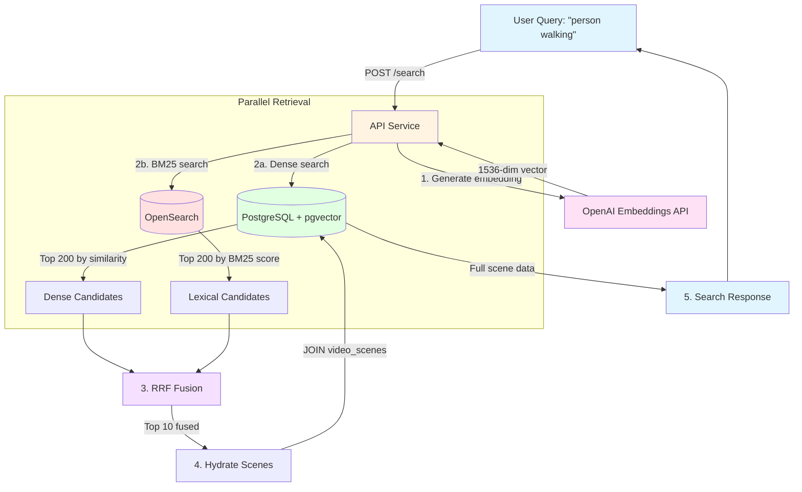
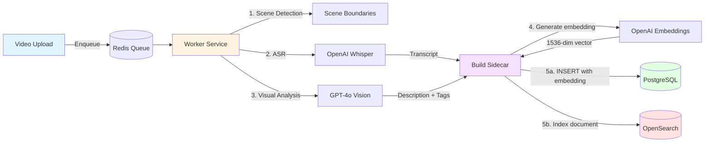

# Heimdex Search Pipeline Documentation

**Last Updated:** 2025-12-15
**Status:** Production
**Architecture:** Hybrid Search (Dense Vector + BM25 Lexical + RRF Fusion)

---

## Table of Contents

1. [High-Level Overview](#high-level-overview)
2. [Components & Responsibilities](#components--responsibilities)
3. [Searchable Data Model](#searchable-data-model)
4. [Indexing Pipeline](#indexing-pipeline)
5. [Query Pipeline](#query-pipeline)
6. [Ranking & Scoring](#ranking--scoring)
7. [OpenSearch Specifics](#opensearch-specifics)
8. [Database Search Specifics](#database-search-specifics)
9. [Edge Cases & Fallbacks](#edge-cases--fallbacks)
10. [Observability & Debugging](#observability--debugging)
11. [Performance & Unit Economics](#performance--unit-economics)
12. [Appendix: Code Pointer Index](#appendix-code-pointer-index)

---

## High-Level Overview

### How It Works in 60 Seconds

Heimdex implements a **hybrid search system** that combines semantic understanding (dense vectors) with keyword matching (BM25) to find relevant video scenes:

1. **Indexing**: When a video is uploaded, it's split into scenes, each enriched with ASR transcripts, visual descriptions, and tags, then indexed into both PostgreSQL (pgvector) and OpenSearch
2. **Query**: User submits natural language query → system generates embedding and executes parallel searches across both retrieval systems
3. **Fusion**: Results from dense and lexical searches are combined using Reciprocal Rank Fusion (RRF)
4. **Response**: Fused results are hydrated with full scene metadata and returned ranked by relevance

### Architecture Diagram



### Indexing Flow



---

## Components & Responsibilities

Heimdex is a **microservices architecture** with three main services:

### 1. Frontend (Next.js)
- **Location**: `services/frontend/`
- **Role**: User interface for search, video playback, scene browsing
- **Search Integration**: Calls `/api/search` endpoint via REST API
- **Authentication**: Uses Supabase client-side auth with JWT tokens

### 2. API Service (FastAPI)
- **Location**: `services/api/`
- **Role**: HTTP API gateway, search orchestration, authentication
- **Key Modules**:
  - `src/routes/search.py`: Search endpoint handler
  - `src/domain/search/fusion.py`: RRF fusion logic
  - `src/adapters/opensearch_client.py`: OpenSearch BM25 queries
  - `src/adapters/database.py`: PostgreSQL pgvector queries
  - `src/adapters/openai_client.py`: Embedding generation
- **Concurrency**: Uses `ThreadPoolExecutor` for parallel dense + lexical retrieval
- **Security**: JWT validation via Supabase, enforces owner_id filtering

### 3. Worker Service (Python + Dramatiq)
- **Location**: `services/worker/`
- **Role**: Asynchronous video processing, scene indexing
- **Key Modules**:
  - `src/domain/video_processor.py`: Main processing pipeline orchestrator
  - `src/domain/sidecar_builder.py`: Scene metadata generation
  - `src/domain/scene_detector.py`: PySceneDetect integration
  - `src/adapters/opensearch_client.py`: OpenSearch document indexing
  - `src/adapters/database.py`: PostgreSQL scene insertion
- **Concurrency**: Uses `ThreadPoolExecutor` for parallel scene processing within a video
- **Queue**: Redis-backed Dramatiq actor system

### 4. Supporting Services

**PostgreSQL (Supabase)**
- Vector storage via `pgvector` extension
- RLS policies for multi-tenancy
- Stored procedure: `search_scenes_by_embedding`

**OpenSearch 2.x**
- BM25 lexical search
- Korean analysis via `analysis-nori` plugin
- English stemming via built-in analyzer

**Redis**
- Dramatiq task queue
- No search-related caching (currently)

**OpenAI API**
- Whisper: Audio transcription
- GPT-4o Vision: Visual scene analysis
- text-embedding-3-small: 1536-dim embeddings

### Configuration Flags

All search behavior is controlled via environment variables (`.env`):

| Variable | Default | Effect |
|----------|---------|--------|
| `HYBRID_SEARCH_ENABLED` | `true` | Enables/disables hybrid search (dense+lexical). If `false`, uses dense-only |
| `FUSION_METHOD` | `minmax_mean` | Fusion algorithm: `minmax_mean` (score-based) or `rrf` (rank-based) |
| `FUSION_WEIGHT_DENSE` | `0.7` | Weight for dense scores in minmax_mean fusion (must sum to 1.0 with lexical) |
| `FUSION_WEIGHT_LEXICAL` | `0.3` | Weight for lexical scores in minmax_mean fusion (must sum to 1.0 with dense) |
| `FUSION_MINMAX_EPS` | `1e-9` | Epsilon to avoid division by zero in min-max normalization |
| `RRF_K` | `60` | RRF constant for rank fusion (higher = less difference between top/bottom ranks) |
| `CANDIDATE_K_DENSE` | `200` | Number of candidates to retrieve from pgvector before fusion |
| `CANDIDATE_K_LEXICAL` | `200` | Number of candidates to retrieve from OpenSearch before fusion |
| `SEARCH_DEBUG` | `false` | If true, include debug fields (raw/norm scores, ranks) in response |
| `OPENSEARCH_URL` | `http://opensearch:9200` | OpenSearch cluster URL |
| `OPENSEARCH_INDEX_SCENES` | `scene_docs` | Index name for scene documents |
| `OPENSEARCH_TIMEOUT_S` | `1.0` | Timeout for OpenSearch requests |
| `OPENSEARCH_INDEXING_ENABLED` | `true` | Master switch for all OpenSearch indexing operations |

**Search Modes Determined at Runtime:**

1. **Hybrid Mode** (ideal): `HYBRID_SEARCH_ENABLED=true` + OpenSearch available + embedding succeeds
2. **Lexical-Only Mode** (embedding failure fallback): Embedding generation fails but OpenSearch available
3. **Dense-Only Mode** (OpenSearch failure fallback): OpenSearch unavailable but embedding succeeds
4. **Complete Failure**: Both embedding and OpenSearch fail → HTTP 500

---

## Searchable Data Model

### Entities Involved

**Videos** (`videos` table)
- Primary entity representing uploaded video files
- Fields: `id`, `owner_id`, `storage_path`, `status`, `duration_s`, `frame_rate`, `width`, `height`, `thumbnail_url`, `video_summary`, `full_transcript`, `created_at`
- Not directly searchable (scenes are the search unit)

**Video Scenes** (`video_scenes` table)
- **Primary search unit**: Each scene is an indexable document
- Scenes represent temporal segments of videos (typically 2-10 seconds)
- Fields indexed for search:

| Field | Type | Stored In | Purpose |
|-------|------|-----------|---------|
| `id` | UUID | PG, OS | Scene identifier |
| `video_id` | UUID | PG, OS | Parent video reference |
| `owner_id` | UUID (derived) | OS | Security filtering (joined from `videos`) |
| `index` | int | PG, OS | Scene sequence number within video |
| `start_s` | float | PG, OS | Start timestamp |
| `end_s` | float | PG, OS | End timestamp |
| `transcript_segment` | text | PG, OS | ASR transcript for this scene |
| `visual_summary` | text | PG, OS | Legacy visual description (v1) |
| `visual_description` | text | PG, OS | Richer 1-2 sentence description (v2) |
| `visual_entities` | text[] | PG, OS | Detected entities (e.g., "person", "car") |
| `visual_actions` | text[] | PG, OS | Detected actions (e.g., "walking", "talking") |
| `tags` | text[] | PG, OS | Normalized tags (lowercase, deduplicated) |
| `combined_text` | text | PG, OS | Concatenation of visual + transcript (legacy) |
| `search_text` | text | PG | Optimized embedding input (v2) |
| `embedding` | vector(1536) | PG | Dense vector for semantic search |
| `thumbnail_url` | text | PG, OS | Scene thumbnail image |
| `sidecar_version` | text | PG | Schema version ("v1" or "v2") |
| `created_at` | timestamp | PG, OS | Indexing timestamp |

**Derived Fields in OpenSearch:**
- `tags_text`: `" ".join(tags)` → enables BM25 search over tags
- `.ko` subfields: Korean-analyzed variants (e.g., `transcript_segment.ko`)
- `.en` subfields: English-analyzed variants (e.g., `transcript_segment.en`)

### ID and Join Keys

**Primary Keys:**
- `videos.id` → UUID
- `video_scenes.id` → UUID

**Foreign Keys:**
- `video_scenes.video_id` → `videos.id` (CASCADE DELETE)
- `videos.owner_id` → `auth.users.id` (Supabase Auth, CASCADE DELETE)

**Security Enforcement:**
- PostgreSQL: Row-Level Security (RLS) policies filter by `auth.uid() = owner_id`
- OpenSearch: Application-level filtering via `{"term": {"owner_id": user_id}}` in every query
- No cross-user data leakage possible

**Search Flow Join:**
1. User authenticated → `user_id` extracted from JWT
2. Dense search RPC: `search_scenes_by_embedding(filter_user_id=user_id)` → joins `video_scenes` to `videos` on `video_id` to filter by `owner_id`
3. Lexical search: `{"term": {"owner_id": user_id}}` filter in OpenSearch query
4. Hydration: `get_scenes_by_ids(scene_ids)` → fetches scenes already scoped to user via prior filters

---

## Indexing Pipeline

### When Indexing Occurs

**Trigger 1: New Video Upload**
1. User uploads video via frontend → API creates `videos` record with `status=PENDING`
2. API enqueues `process_video.send(video_id)` task to Redis queue
3. Worker picks up task and runs full processing pipeline (see below)

**Trigger 2: Video Reprocessing**
1. User requests reprocessing (e.g., wrong language detected)
2. API clears transcript and sets `status=PENDING`
3. API enqueues `process_video.send(video_id)` again
4. Worker detects existing scenes and skips already-processed ones (idempotent)

**Trigger 3: Manual Reindexing**
1. Admin runs `services/worker/src/scripts/reindex_opensearch.py`
2. Script fetches all scenes from PostgreSQL and bulk-indexes to OpenSearch
3. Used after: index mapping changes, OpenSearch data loss, initial setup

### Indexing Pipeline Steps

**Full pipeline** (see `services/worker/src/domain/video_processor.py:process_video`):

```
1. Fetch video record from database
2. Download video file from Supabase Storage to /tmp/<video_id>/
3. Extract metadata (duration, fps, resolution, EXIF) via ffmpeg
4. Detect scenes using PySceneDetect (multi-detector strategy)
5. Extract audio and transcribe with OpenAI Whisper (cached in DB)
6. FOR EACH SCENE (parallel via ThreadPoolExecutor):
   a. Extract keyframes via ffmpeg
   b. Rank frames by quality (sharpness, contrast)
   c. Analyze best frame with GPT-4o Vision (unless cost-optimized away)
   d. Build sidecar: combine transcript + visual + tags
   e. Generate embedding from search_text
   f. INSERT into PostgreSQL (video_scenes table)
   g. Index into OpenSearch (non-blocking, logged on failure)
7. Upload video thumbnail (first scene's frame)
8. Generate video-level summary from scene descriptions
9. Mark video status=READY
10. Cleanup /tmp/<video_id>/
```

### Where Embeddings Are Generated

**Location:** `services/worker/src/domain/sidecar_builder.py:_create_scene_embedding`

**Timing:** During sidecar building, after `search_text` is assembled

**Input Text Construction:**
```python
def _build_search_text(transcript, visual_description, language):
    # Transcript-first strategy: ASR has highest signal-to-noise
    parts = []
    if transcript:
        parts.append(transcript)
    if visual_description:
        parts.append(visual_description)

    return " ".join(parts) if parts else ("내용 없음" if language == "ko" else "No content")
```

**Model:** OpenAI `text-embedding-3-small` (1536 dimensions)

**Embedding Metadata** (stored in `embedding_metadata` JSONB field):
```json
{
  "model": "text-embedding-3-small",
  "dimensions": 1536,
  "input_text_hash": "a3f2e9b...",  # SHA-256 first 16 chars
  "input_text_length": 245
}
```

**Cost Optimization:** Embeddings are always generated (mandatory for search), but visual analysis may be skipped for short scenes with rich transcripts.

### Where OpenSearch Documents Are Written

**Location:** `services/worker/src/adapters/database.py:_index_scene_to_opensearch`

**Timing:** Immediately after `INSERT INTO video_scenes` succeeds

**Document Structure:**
```json
{
  "scene_id": "550e8400-e29b-41d4-a716-446655440000",
  "video_id": "660e8400-e29b-41d4-a716-446655440000",
  "owner_id": "770e8400-e29b-41d4-a716-446655440000",
  "index": 5,
  "start_s": 12.5,
  "end_s": 18.2,
  "transcript_segment": "안녕하세요, 오늘은 날씨가 좋네요",
  "visual_summary": "Two people talking outdoors",
  "visual_description": "A conversation between two individuals in a park setting",
  "combined_text": "Two people talking. 안녕하세요, 오늘은 날씨가 좋네요",
  "tags": ["person", "talking", "outdoor"],
  "tags_text": "person talking outdoor",
  "thumbnail_url": "https://...",
  "created_at": "2025-12-15T10:30:00Z"
}
```

**Index Operation:** `opensearch_client.upsert_scene_doc` → uses `scene_id` as document ID for idempotent upserts

**Failure Handling:**
- Logged as warning but does NOT fail scene creation
- Scene remains in PostgreSQL and searchable via dense-only mode
- Operator can later run `reindex_opensearch.py` to backfill

### Idempotency and Reprocessing

**Scene-Level Idempotency:**
- Worker checks `db.get_existing_scene_indices(video_id)` before processing
- Skips scenes already indexed (supports retry after partial failure)
- PostgreSQL: `UNIQUE(video_id, index)` constraint prevents duplicates
- OpenSearch: `scene_id` as doc ID enables upsert (replace if exists)

**Video-Level Reprocessing:**
- User requests reprocess → API calls `db.clear_video_for_reprocess(video_id)`
- Clears: `full_transcript`, `video_summary`, `has_rich_semantics`
- Deletes all scenes: `db.delete_scenes_for_video(video_id)`
- Worker re-runs full pipeline from scratch

**Sidecar Versioning:**
- Each scene has `sidecar_version` field ("v1" or "v2")
- Future: query for `sidecar_version != CURRENT_VERSION` to identify reprocess candidates
- Currently: manual reprocessing only

---

## Query Pipeline

### Request Shape

**Endpoint:** `POST /api/search`

**Request Body:**
```json
{
  "query": "person walking in park",
  "video_id": "660e8400-e29b-41d4-a716-446655440000",  // Optional: scope to single video
  "limit": 10,       // Max results to return (1-100)
  "threshold": 0.2   // Similarity threshold for dense search (0.0-1.0)
}
```

**Authentication:** Bearer token (Supabase JWT) in `Authorization` header

**Response:**
```json
{
  "query": "person walking in park",
  "results": [
    {
      "id": "550e8400-e29b-41d4-a716-446655440000",
      "video_id": "660e8400-e29b-41d4-a716-446655440000",
      "index": 12,
      "start_s": 45.2,
      "end_s": 52.8,
      "transcript_segment": "...",
      "visual_summary": "...",
      "visual_description": "...",
      "visual_entities": ["person", "tree"],
      "visual_actions": ["walking"],
      "tags": ["person", "walking", "outdoor"],
      "thumbnail_url": "https://...",
      "similarity": 0.8234,  // Fused score (0-1 range)
      "created_at": "2025-12-15T10:30:00Z"
    }
    // ... up to 10 results
  ],
  "total": 10,
  "latency_ms": 245
}
```

### Query Pipeline: Step-by-Step

**Code Pointer:** `services/api/src/routes/search.py:search_scenes()`

```
┌─────────────────────────────────────────────────────────────┐
│ Step 1: Authentication & Authorization                      │
│ - Extract user_id from JWT via get_current_user()          │
│ - If video_id provided, verify ownership                   │
│ - Reject if user doesn't own video (HTTP 403)              │
└─────────────────────────────────────────────────────────────┘
                          ↓
┌─────────────────────────────────────────────────────────────┐
│ Step 2: Generate Query Embedding                           │
│ - openai_client.create_embedding(query)                    │
│ - Returns 1536-dim vector                                  │
│ - On failure: flag embedding_failed=True                   │
└─────────────────────────────────────────────────────────────┘
                          ↓
┌─────────────────────────────────────────────────────────────┐
│ Step 3: Determine Search Strategy                          │
│ - Hybrid: embedding OK + OpenSearch available              │
│ - Lexical-only: embedding failed + OpenSearch available    │
│ - Dense-only: embedding OK + OpenSearch unavailable        │
│ - Fail: both failed → HTTP 500                             │
└─────────────────────────────────────────────────────────────┘
                          ↓
┌─────────────────────────────────────────────────────────────┐
│ Step 4a: Dense Retrieval (if embedding succeeded)          │
│ - db.search_scenes(query_embedding, user_id, video_id,     │
│                    limit=200, threshold=0.2)                │
│ - Calls PostgreSQL RPC: search_scenes_by_embedding         │
│ - Returns top 200 scenes by cosine similarity               │
│ - Converts to Candidate(scene_id, rank, score)             │
└─────────────────────────────────────────────────────────────┘
                          ↓
┌─────────────────────────────────────────────────────────────┐
│ Step 4b: Lexical Retrieval (if OpenSearch available)       │
│ - opensearch_client.bm25_search(query, owner_id,           │
│                                  video_id, size=200)        │
│ - Executes BM25 multi_match query                          │
│ - Returns top 200 scenes by BM25 score                     │
│ - Converts to Candidate(scene_id, rank, score)             │
└─────────────────────────────────────────────────────────────┘
                          ↓
          (Steps 4a and 4b run in parallel via ThreadPoolExecutor)
                          ↓
┌─────────────────────────────────────────────────────────────┐
│ Step 5: Reciprocal Rank Fusion (RRF)                       │
│ - rrf_fuse(dense_candidates, lexical_candidates,           │
│            rrf_k=60, top_k=10)                              │
│ - Computes fused_score = Σ 1/(k + rank_i) for each system  │
│ - Sorts by fused_score descending                          │
│ - Returns top 10 FusedCandidate objects                    │
└─────────────────────────────────────────────────────────────┘
                          ↓
┌─────────────────────────────────────────────────────────────┐
│ Step 6: Hydrate Scenes                                     │
│ - Extract scene_ids from FusedCandidate list               │
│ - db.get_scenes_by_ids(scene_ids, preserve_order=True)     │
│ - Fetches full scene records from PostgreSQL               │
│ - Preserves RRF ranking order                              │
│ - Attaches fused_score to each scene as "similarity"       │
└─────────────────────────────────────────────────────────────┘
                          ↓
┌─────────────────────────────────────────────────────────────┐
│ Step 7: Log & Return                                       │
│ - db.log_search_query(user_id, query, results_count,       │
│                        latency_ms, video_id)                │
│ - Build SearchResponse with query, results, total, latency │
│ - Reset OpenSearch availability cache for next request     │
└─────────────────────────────────────────────────────────────┘
```

### Query Parsing / Normalization / Rewrite

**Current State:** No query parsing or rewriting is performed

**Query is used as-is for:**
- Embedding generation (sent directly to OpenAI)
- BM25 search (sent directly to OpenSearch)

**Future Enhancements:**
- Language detection (route to `.ko` vs `.en` subfields preferentially)
- Stop word removal (for lexical search only)
- Synonym expansion (e.g., "person" → "people", "human")
- Query spelling correction

### Filters Applied

**User/Tenant Scoping (MANDATORY):**
- Dense search: `filter_user_id` parameter in RPC call → SQL `WHERE v.owner_id = filter_user_id`
- Lexical search: `{"term": {"owner_id": user_id}}` in OpenSearch filter clause

**Video Scoping (OPTIONAL):**
- If `video_id` provided in request:
  - Dense: `filter_video_id` parameter → SQL `WHERE vs.video_id = filter_video_id`
  - Lexical: `{"term": {"video_id": video_id}}` in OpenSearch filter clause

**Authorization Checks:**
- Before search, if `video_id` provided:
  - Fetch video record from DB
  - Verify `video.owner_id == current_user.user_id`
  - Reject with HTTP 403 if mismatch

### Retrieval Paths

**Path 1: Dense Vector Search (pgvector)**

**Function:** `services/api/src/adapters/database.py:search_scenes()`

**Mechanism:**
1. Calls PostgreSQL stored procedure: `search_scenes_by_embedding`
2. Uses pgvector cosine distance operator: `<=>` (L2 distance derived)
3. Similarity computed as: `1 - (embedding <=> query_embedding)`
4. Filters: `similarity > threshold` AND user/video scoping
5. Ordered by: `embedding <=> query_embedding` ASC (closest first)
6. Returns: Top `limit` scenes with `similarity` score

**Index Used:** HNSW index on `video_scenes.embedding` column
```sql
CREATE INDEX idx_video_scenes_embedding ON video_scenes
USING hnsw (embedding vector_cosine_ops)
WITH (m = 16, ef_construction = 64);
```

**Candidates Retrieved:** Top 200 (configured via `CANDIDATE_K_DENSE`)

---

**Path 2: Lexical BM25 Search (OpenSearch)**

**Function:** `services/api/src/adapters/opensearch_client.py:bm25_search()`

**Mechanism:**
1. Constructs `multi_match` query across all text fields with boosts
2. Searches base field + Korean (.ko) + English (.en) subfields
3. Uses `best_fields` type → picks highest scoring field per document
4. Applies `minimum_should_match: "2<75%"` → fuzzy matching for longer queries
5. Filters: `owner_id` (term match) AND optional `video_id`
6. Returns: Top `size` documents with BM25 `_score`

**Candidates Retrieved:** Top 200 (configured via `CANDIDATE_K_LEXICAL`)

---

**Path 3: Hybrid (Both Dense + Lexical)**

**Default mode when:**
- `HYBRID_SEARCH_ENABLED=true`
- OpenSearch is available (ping succeeds)
- Embedding generation succeeds

**Execution:**
- Both retrievals run **in parallel** via `ThreadPoolExecutor(max_workers=2)`
- Results merged by RRF fusion

---

### Fusion Method: Reciprocal Rank Fusion (RRF)

**Code Pointer:** `services/api/src/domain/search/fusion.py:rrf_fuse()`

**Formula:**
```
For each scene ID appearing in either dense or lexical results:
  fused_score = Σ [ 1 / (k + rank_i) ]

Where:
  - k = 60 (configurable via RRF_K)
  - rank_i = rank in each retrieval system (1-indexed)
  - Sum over all systems where scene appeared
```

**Example:**
```
Scene A:
  - Dense rank: 1 → 1/(60+1) = 0.0164
  - Lexical rank: 3 → 1/(60+3) = 0.0159
  - Fused: 0.0323

Scene B:
  - Dense rank: None
  - Lexical rank: 1 → 1/(60+1) = 0.0164
  - Fused: 0.0164

Scene C:
  - Dense rank: 2 → 1/(60+2) = 0.0161
  - Lexical rank: None
  - Fused: 0.0161

Final Ranking: A (0.0323) > B (0.0164) > C (0.0161)
```

**Tie-Breaking:**
1. Higher fused_score first
2. Better (lower) dense_rank first
3. Better (lower) lexical_rank first
4. Alphabetical by scene_id (stability)

**Top-K Selection:** After sorting, return top 10 (configured via `request.limit`)

**Fallback Modes:**
- `dense_only_fusion()`: Uses similarity score directly as fused_score
- `lexical_only_fusion()`: Uses BM25 score directly as fused_score

---

### Reranking Stage

**Current State:** No reranking is performed

**Future Enhancements:**
- Cross-encoder reranking with sentence-transformers
- LLM-based reranking (GPT-4 judges relevance)
- User feedback signal integration (click-through rate)

---

### Final Shaping

**Deduplication:** Implicit (scene IDs are unique, union of sets)

**Pagination:** Currently returns single page (top `limit` results). No offset/cursor support.

**Highlight Snippets:** Not implemented (future: highlight matching text in transcript)

**Sorting:** By fused_score descending (or similarity if dense/lexical-only mode)

**Score Normalization:**
- Dense scores: Already 0-1 range (cosine similarity)
- Lexical scores: BM25 raw scores (unbounded, typically 0-50)
- Fused scores: RRF reciprocal ranks (typically 0.001-0.03 range)
- Returned to user as `similarity` field (preserves original scale for transparency)

---

## Ranking & Scoring

### Score Scale Incompatibility (The Problem)

When combining results from multiple retrieval systems, we face a fundamental challenge:

| System | Score Range | Typical Values | Example |
|--------|-------------|----------------|---------|
| **Dense (pgvector)** | [0.0, 1.0] | 0.3 - 0.9 | "walking dog" → 0.78 |
| **Lexical (BM25)** | [0, ∞) | 5 - 50 | "walking dog" → 23.4 |

**Why this matters:** If we simply add or average raw scores, BM25's larger values dominate:
- Dense: 0.78, Lexical: 23.4 → Average: 12.09 (99% from lexical!)
- This defeats the purpose of hybrid search

**Solution:** Normalize scores before combining, or use rank-based fusion (RRF).

---

### Fusion Methods

Heimdex supports two fusion methods, configurable via `FUSION_METHOD` environment variable:

#### 1. Min-Max Weighted Mean (Default)

**Config:** `FUSION_METHOD=minmax_mean`

**Algorithm:**
1. Normalize each system's scores to [0, 1] using min-max normalization
2. Combine with weighted arithmetic mean

**Min-Max Normalization Formula:**
```
norm(x) = (x - min) / (max - min + eps)

Where:
  - min = minimum score in that system's candidate list
  - max = maximum score in that system's candidate list
  - eps = 1e-9 (avoid division by zero)
```

**Edge Cases:**
- Empty list → Skip system (contributes 0)
- Single element → Normalized to 1.0 (full contribution)
- All same score (max == min) → All normalized to 1.0 (uniform contribution)

**Weighted Mean Formula:**
```
final_score = w_dense × dense_norm + w_lexical × lexical_norm

Where:
  - w_dense = FUSION_WEIGHT_DENSE (default: 0.7)
  - w_lexical = FUSION_WEIGHT_LEXICAL (default: 0.3)
  - Weights must sum to 1.0
```

**If scene only in one system:**
- Missing normalized score treated as 0.0
- Scene still gets partial score from present system

**Example:**
```
Dense candidates:   a=0.95, b=0.85, c=0.75
Lexical candidates: b=30.0, d=25.0, e=20.0

Step 1: Normalize dense scores
  a: (0.95-0.75)/(0.95-0.75) = 1.0
  b: (0.85-0.75)/(0.95-0.75) = 0.5
  c: (0.75-0.75)/(0.95-0.75) = 0.0

Step 2: Normalize lexical scores
  b: (30-20)/(30-20) = 1.0
  d: (25-20)/(30-20) = 0.5
  e: (20-20)/(30-20) = 0.0

Step 3: Weighted mean (0.7/0.3)
  a: 0.7×1.0 + 0.3×0.0 = 0.70  (dense only)
  b: 0.7×0.5 + 0.3×1.0 = 0.65  (both systems!)
  c: 0.7×0.0 + 0.3×0.0 = 0.00  (lowest dense)
  d: 0.7×0.0 + 0.3×0.5 = 0.15  (lexical only)
  e: 0.7×0.0 + 0.3×0.0 = 0.00  (lowest lexical)

Final ranking: a (0.70) > b (0.65) > d (0.15) > c, e (0.00)
```

**When to use Min-Max Mean:**
- You want explicit control over system weights
- Your scores within each system are reliable
- You want to tune based on query patterns (more semantic vs keyword-focused)

---

#### 2. Reciprocal Rank Fusion (RRF)

**Config:** `FUSION_METHOD=rrf`

**Algorithm:**
- Uses rank positions instead of raw scores
- Naturally handles scale differences (ignores scores entirely)

**RRF Formula:**
```
RRF_score(scene) = Σ_i [ 1 / (k + rank_i(scene)) ]

Where:
  - i ∈ {dense, lexical} (retrieval systems)
  - k = RRF_K (default: 60)
  - rank_i = 1-indexed rank in system i (0 contribution if not present)
```

**Example:**
```
Dense: a=rank1, b=rank2
Lexical: b=rank1, c=rank2

With k=60:
  a: 1/(60+1) + 0       = 0.0164
  b: 1/(60+2) + 1/(60+1) = 0.0161 + 0.0164 = 0.0325  ← highest (both systems)
  c: 0       + 1/(60+2) = 0.0161

Final ranking: b (0.0325) > a (0.0164) > c (0.0161)
```

**Tuning the k parameter:**
- k=60: Standard choice (original paper recommendation)
- k<60: Top ranks get much higher weight (more aggressive)
- k>60: Flatter curve, less difference between ranks (more egalitarian)

**When to use RRF:**
- Raw scores have outliers or are unreliable
- You want equal weighting without tuning
- Scores from one system vary wildly across queries

---

### Configuration Reference

**Environment Variables:**

| Variable | Default | Description |
|----------|---------|-------------|
| `FUSION_METHOD` | `minmax_mean` | Fusion algorithm: `minmax_mean` or `rrf` |
| `FUSION_WEIGHT_DENSE` | `0.7` | Weight for dense scores (minmax_mean only) |
| `FUSION_WEIGHT_LEXICAL` | `0.3` | Weight for lexical scores (minmax_mean only) |
| `FUSION_MINMAX_EPS` | `1e-9` | Epsilon to avoid division by zero |
| `RRF_K` | `60` | K constant for RRF (rrf only) |

**Per-Request Overrides:**

Clients can override fusion settings per request:

```json
POST /api/search
{
  "query": "person walking",
  "limit": 10,
  "fusion_method": "minmax_mean",
  "weight_dense": 0.5,
  "weight_lexical": 0.5
}
```

**Validation:** Weights must sum to approximately 1.0 (tolerance: 0.01)

---

### Response Schema

**Score Fields in Results:**

| Field | Type | Description |
|-------|------|-------------|
| `score` | float | The ranking score used for ordering |
| `score_type` | string | Fusion method: `minmax_mean`, `rrf`, `dense_only`, `lexical_only` |
| `similarity` | float | **DEPRECATED** - Alias for `score` (backward compatibility) |

**Debug Fields (when `SEARCH_DEBUG=true`):**

| Field | Type | Description |
|-------|------|-------------|
| `dense_score_raw` | float | Raw cosine similarity from pgvector |
| `lexical_score_raw` | float | Raw BM25 score from OpenSearch |
| `dense_score_norm` | float | Min-max normalized dense score [0, 1] |
| `lexical_score_norm` | float | Min-max normalized lexical score [0, 1] |
| `dense_rank` | int | Rank in dense retrieval (1-indexed) |
| `lexical_rank` | int | Rank in lexical retrieval (1-indexed) |

**Response Metadata:**

```json
{
  "query": "person walking",
  "results": [...],
  "total": 10,
  "latency_ms": 245,
  "fusion_method": "minmax_mean",
  "fusion_weights": {"dense": 0.7, "lexical": 0.3}
}
```

---

### Tuning Guidance

**Recommended Starting Points:**

| Use Case | Dense Weight | Lexical Weight | Rationale |
|----------|--------------|----------------|-----------|
| **General search** | 0.7 | 0.3 | Semantic understanding primary, keywords secondary |
| **Exact phrase queries** | 0.3 | 0.7 | Users expect exact text matches |
| **Multilingual content** | 0.8 | 0.2 | Embeddings handle cross-lingual better |
| **Noisy transcripts** | 0.5 | 0.5 | Balance errors in both systems |

**How to Tune:**

1. **Start with defaults** (0.7/0.3)
2. **Collect relevance feedback** - Are top results what users want?
3. **Test with representative queries:**
   - Semantic queries: "happy moment", "people discussing"
   - Keyword queries: "iPhone 15", exact transcript phrases
4. **Adjust weights** based on which system performs better
5. **Consider RRF** if one system has erratic scores

**Min-Max vs RRF Tradeoffs:**

| Aspect | Min-Max Mean | RRF |
|--------|--------------|-----|
| Tunability | High (explicit weights) | Low (only k parameter) |
| Outlier sensitivity | Can be affected | Very robust |
| Score interpretability | [0, 1] normalized | Small reciprocal values |
| Implicit weighting | Explicit via weights | ~50/50 implicit |

---

### Exact Scoring Formulas

**Hybrid Mode (Min-Max Mean - Default):**
```
final_score = w_dense × dense_norm + w_lexical × lexical_norm

Where:
  - dense_norm = (dense_score - min_dense) / (max_dense - min_dense + eps)
  - lexical_norm = (lexical_score - min_lexical) / (max_lexical - min_lexical + eps)
  - w_dense = FUSION_WEIGHT_DENSE (default: 0.7)
  - w_lexical = FUSION_WEIGHT_LEXICAL (default: 0.3)
  - eps = FUSION_MINMAX_EPS (default: 1e-9)
```

**Hybrid Mode (RRF):**
```
fused_score(scene) = Σ_i [ 1 / (k + rank_i(scene)) ]

Where:
  - i ∈ {dense, lexical} (retrieval systems)
  - k = RRF_K (default: 60)
  - rank_i(scene) = 1-indexed rank of scene in system i
                    (0 contribution if scene not in that system's results)
```

**Dense-Only Mode:**
```
similarity = 1 - (embedding <=> query_embedding)

Where:
  - <=> is pgvector L2 distance operator
  - Result is cosine similarity in [0, 1] range
  - Higher = more similar
```

**Lexical-Only Mode:**
```
score = BM25(query, document)

BM25 formula (OpenSearch default):
  score(d, q) = Σ_{t ∈ q} IDF(t) · [ f(t, d) · (k1 + 1) ] /
                                   [ f(t, d) + k1 · (1 - b + b · |d| / avgdl) ]
Where:
  - IDF(t) = inverse document frequency of term t
  - f(t, d) = term frequency of t in document d
  - |d| = document length (number of terms)
  - avgdl = average document length across corpus
  - k1 = 1.2 (saturation parameter, OpenSearch default)
  - b = 0.75 (length normalization, OpenSearch default)
```

### Where Weights Come From

**Field Boosts (Lexical Search):**

Hardcoded in `services/api/src/adapters/opensearch_client.py:bm25_search()`:

```python
"fields": [
    "tags_text^4",              # Tags: Highest boost (4x)
    "tags_text.ko^4",
    "tags_text.en^4",

    "transcript_segment^3",     # Transcript: High boost (3x)
    "transcript_segment.ko^3",
    "transcript_segment.en^3",

    "visual_description^2",     # Visual desc: Medium boost (2x)
    "visual_description.ko^2",
    "visual_description.en^2",

    "visual_summary^2",         # Visual summary: Medium boost (2x)
    "visual_summary.ko^2",
    "visual_summary.en^2",

    "combined_text^1",          # Combined: Base boost (1x)
    "combined_text.ko^1",
    "combined_text.en^1",
]
```

**Rationale:**
- Tags: Manually curated, high precision → highest boost
- Transcript: ASR has high signal-to-noise → high boost
- Visual descriptions: More subjective, lower signal → medium boost
- Combined text: Redundant with other fields → base boost

**No UI Controls:** Weights are currently hardcoded. No user-facing sliders for adjusting ASR/image/metadata weights.

**Future:** Could add per-user weight preferences in `user_profiles.scene_detector_preferences` or new `search_preferences` field.

---

### Score Normalization

**Dense Scores (Cosine Similarity):**
- Already normalized to [0, 1] range
- 1 = perfect match, 0 = orthogonal vectors
- No further normalization needed

**Lexical Scores (BM25):**
- Unbounded (typically 0-50, but can exceed)
- Not normalized before RRF fusion
- RRF uses **rank** not score, so absolute scale doesn't matter

**Fused Scores (RRF):**
- Reciprocal rank values are inherently normalized by k parameter
- Typical range: 0.001 (low rank) to 0.03 (high rank)
- Returned as-is to user as `similarity` field

**Presentation to User:**
- `similarity` field in response represents fused_score
- No rescaling to 0-100 percentage
- Higher = better (monotonic)

---

### Tie Handling

**Within RRF Fusion:**

Tie-breaking logic in `services/api/src/domain/search/fusion.py:rrf_fuse()`:

```python
def sort_key(candidate: FusedCandidate) -> tuple:
    return (
        -candidate.fused_score,         # 1. Higher fused score first (negative for desc)
        candidate.dense_rank or inf,    # 2. Better dense rank first
        candidate.lexical_rank or inf,  # 3. Better lexical rank first
        candidate.scene_id,             # 4. Stable tiebreaker (alphabetical UUID)
    )
```

**Within Dense Search:**

PostgreSQL ordering: `ORDER BY embedding <=> query_embedding ASC`
- Deterministic: same query always produces same ranking
- Ties are extremely unlikely (floating point precision)
- If tied: PostgreSQL uses row insertion order

**Within Lexical Search:**

OpenSearch ordering: `ORDER BY _score DESC`
- BM25 scores are floats with high precision
- Ties are unlikely but possible
- If tied: OpenSearch uses internal document ID order (not guaranteed stable)

---

## OpenSearch Specifics

### Index Naming Strategy

**Strategy:** Single shared index for all users

**Index Name:** `scene_docs` (configured via `OPENSEARCH_INDEX_SCENES`)

**Rationale:**
- **Pro:** Simpler operations (one index to manage, reindex, optimize)
- **Pro:** Better IDF statistics (larger corpus improves BM25 quality)
- **Pro:** Lower resource overhead (no per-tenant sharding)
- **Con:** Security relies on application-level filtering (must ensure `owner_id` filter is ALWAYS present)

**Alternative (not implemented):** Per-tenant indices (`scene_docs_<user_id>`)
- **Pro:** Stronger security isolation
- **Con:** Operational complexity (thousands of indices)
- **Con:** Worse BM25 quality (small corpus per tenant)

### Mappings and Settings

**Full Mapping:** See `services/api/src/adapters/opensearch_client.py:SCENE_INDEX_MAPPING`

**Settings:**
```json
{
  "number_of_shards": 1,
  "number_of_replicas": 0,
  "refresh_interval": "1s",
  "analysis": {
    "analyzer": {
      "ko_nori": {
        "type": "custom",
        "tokenizer": "nori_tokenizer",
        "filter": ["lowercase"]
      },
      "en_english": {
        "type": "english"
      }
    }
  }
}
```

**Key Properties:**
- Single shard: Optimized for small-medium datasets (<10M docs)
- No replicas: Accepted risk for cost savings (data is in PostgreSQL)
- 1s refresh: Near real-time search (new docs visible within 1 second)

**Multi-Field Strategy:**

Each text field has 3 variants:
- **Base field** (`standard` analyzer): Language-agnostic, backward compatible
- **Korean subfield** (`.ko` with `nori_tokenizer`): Morphological analysis for Korean
- **English subfield** (`.en` with `english` analyzer): Stemming and stop words for English

**Example:**
```json
"transcript_segment": {
  "type": "text",
  "analyzer": "standard",
  "fields": {
    "ko": {"type": "text", "analyzer": "ko_nori"},
    "en": {"type": "text", "analyzer": "en_english"}
  }
}
```

**Applied to:**
- `transcript_segment`
- `visual_summary`
- `visual_description`
- `combined_text`
- `tags_text`

**Not multi-fielded:**
- IDs (`scene_id`, `video_id`, `owner_id`) → `keyword` type (exact match only)
- Numeric fields (`index`, `start_s`, `end_s`) → `integer` / `float`
- Metadata (`thumbnail_url`, `created_at`) → Not analyzed

---

### Query DSL Examples

**Example 1: Basic Hybrid Search Query**

Derived from `services/api/src/adapters/opensearch_client.py:bm25_search()`:

```json
{
  "size": 200,
  "query": {
    "bool": {
      "filter": [
        {"term": {"owner_id": "770e8400-e29b-41d4-a716-446655440000"}}
      ],
      "should": [
        {
          "multi_match": {
            "query": "person walking",
            "fields": [
              "tags_text^4", "tags_text.ko^4", "tags_text.en^4",
              "transcript_segment^3", "transcript_segment.ko^3", "transcript_segment.en^3",
              "visual_description^2", "visual_description.ko^2", "visual_description.en^2",
              "visual_summary^2", "visual_summary.ko^2", "visual_summary.en^2",
              "combined_text^1", "combined_text.ko^1", "combined_text.en^1"
            ],
            "type": "best_fields",
            "operator": "or",
            "minimum_should_match": "2<75%"
          }
        }
      ],
      "minimum_should_match": 1
    }
  },
  "_source": ["scene_id"]
}
```

**Explanation:**
- `filter`: Enforces security (only user's scenes)
- `should`: BM25 scoring across all text fields
- `best_fields`: Picks highest-scoring field per document
- `minimum_should_match: "2<75%"`: For queries with >2 terms, 75% must match (fuzzy matching)
- `_source: ["scene_id"]`: Only return scene ID (reduce payload size)

**Example 2: Video-Scoped Search**

```json
{
  "size": 200,
  "query": {
    "bool": {
      "filter": [
        {"term": {"owner_id": "770e8400-e29b-41d4-a716-446655440000"}},
        {"term": {"video_id": "660e8400-e29b-41d4-a716-446655440000"}}
      ],
      "should": [
        {
          "multi_match": {
            "query": "안녕하세요",
            "fields": ["transcript_segment^3", "transcript_segment.ko^3", "transcript_segment.en^3"],
            "type": "best_fields"
          }
        }
      ],
      "minimum_should_match": 1
    }
  }
}
```

---

### How Vector Fields Are Stored

**OpenSearch does NOT store dense vectors.**

**Vector storage:** Exclusively in PostgreSQL (`video_scenes.embedding` column)

**OpenSearch role:** Lexical search only (BM25 over text fields)

**Hybrid architecture rationale:**
- PostgreSQL pgvector: Mature, performant for vector similarity at scale
- OpenSearch: Excellent for full-text search, weak for vector search (k-NN plugin exists but less mature)
- Separation of concerns: dense retrieval in PG, lexical retrieval in OS

---

### Refresh Strategy and Consistency

**Refresh Interval:** `1s` (configured in index settings)

**Consistency Model:**
- **Write:** Scene indexed to OpenSearch immediately after PostgreSQL INSERT
- **Visibility:** Document visible in search within 1 second (eventually consistent)
- **Read:** No consistency guarantees between PG and OS (OS may lag or be stale)

**Failure Scenarios:**
1. **PostgreSQL succeeds, OpenSearch fails:** Scene searchable via dense-only, not lexical
2. **OpenSearch succeeds, PostgreSQL fails:** Scene NOT searchable (no embedding in PG)
3. **OpenSearch lags:** Scene may appear in dense results but not lexical for up to 1 second

**Mitigation:**
- OpenSearch indexing is non-blocking (logged warnings, not exceptions)
- Reindex script available for recovery (`reindex_opensearch.py`)
- Search gracefully degrades to dense-only if OpenSearch unavailable

---

## Database Search Specifics

### SQL Function Signature

**Function:** `search_scenes_by_embedding`

**Definition:** See `infra/migrations/007_add_user_filter_to_search.sql`

```sql
CREATE OR REPLACE FUNCTION search_scenes_by_embedding(
    query_embedding vector(1536),
    match_threshold float DEFAULT 0.5,
    match_count int DEFAULT 10,
    filter_video_id uuid DEFAULT NULL,
    filter_user_id uuid DEFAULT NULL
)
RETURNS TABLE (
    id uuid,
    video_id uuid,
    index int,
    start_s float,
    end_s float,
    transcript_segment text,
    visual_summary text,
    combined_text text,
    thumbnail_url text,
    similarity float
)
LANGUAGE plpgsql
AS $$
BEGIN
    RETURN QUERY
    SELECT
        vs.id,
        vs.video_id,
        vs.index,
        vs.start_s,
        vs.end_s,
        vs.transcript_segment,
        vs.visual_summary,
        vs.combined_text,
        vs.thumbnail_url,
        1 - (vs.embedding <=> query_embedding) as similarity
    FROM video_scenes vs
    INNER JOIN videos v ON vs.video_id = v.id
    WHERE
        (filter_video_id IS NULL OR vs.video_id = filter_video_id)
        AND (filter_user_id IS NULL OR v.owner_id = filter_user_id)
        AND vs.embedding IS NOT NULL
        AND 1 - (vs.embedding <=> query_embedding) > match_threshold
    ORDER BY vs.embedding <=> query_embedding
    LIMIT match_count;
END;
$$;
```

**Key Points:**
- **Join:** `INNER JOIN videos` to access `owner_id` for filtering
- **Similarity:** `1 - (embedding <=> query)` converts L2 distance to similarity score
- **Filter:** `WHERE filter_user_id IS NULL OR owner_id = filter_user_id` (security)
- **Threshold:** `similarity > match_threshold` (default 0.5)
- **Order:** `ORDER BY embedding <=> query` ASC (closest first)
- **Limit:** `LIMIT match_count` (default 10, API uses 200)

---

### Similarity Metric: Cosine via L2 Distance

**pgvector Operator:** `<=>` (L2 distance)

**Conversion to Cosine Similarity:**
```
similarity = 1 - (embedding <=> query_embedding)
```

**Why L2 Distance:**
- OpenAI embeddings are **normalized** (L2 norm = 1)
- For normalized vectors: `cosine_similarity(a, b) = 1 - 0.5 * L2_distance(a, b)²`
- pgvector's `<=>` computes L2 distance directly
- `1 - distance` approximates cosine similarity for small distances

**Alternative (not used):**
- `<#>` operator (negative inner product) → exact cosine for normalized vectors
- Not used in current implementation (historical reasons, negligible difference)

---

### Threshold and TopK Handling

**Threshold Parameter:**
- `match_threshold` in RPC call (default 0.5)
- API uses `request.threshold` (default 0.2 from schema)
- Filters out scenes with `similarity ≤ threshold`

**Effect:**
- Threshold too high: Miss relevant results
- Threshold too low: Include noise
- Current default (0.2): Permissive, rely on RRF fusion to rank quality results higher

**TopK Parameter:**
- `match_count` in RPC call (default 10)
- API uses `settings.candidate_k_dense` (200) for pre-fusion retrieval
- Final top-K applied AFTER RRF fusion (request.limit, default 10)

**Two-Stage Retrieval:**
1. Retrieve 200 candidates from dense + 200 from lexical
2. Fuse to top 10 results
3. Rationale: RRF benefits from larger candidate pools (better re-ranking)

---

### Indexes Required

**Vector Index (HNSW):**
```sql
CREATE INDEX idx_video_scenes_embedding ON video_scenes
USING hnsw (embedding vector_cosine_ops)
WITH (m = 16, ef_construction = 64);
```

**Parameters:**
- `m = 16`: Max edges per node (trade-off: recall vs. memory)
- `ef_construction = 64`: Build-time search depth (higher = better recall, slower build)

**Migration:** `infra/migrations/002_enable_pgvector.sql`

**Alternative (commented out):**
```sql
CREATE INDEX idx_video_scenes_embedding ON video_scenes
USING ivfflat (embedding vector_cosine_ops)
WITH (lists = 100);
```
- IVFFlat: Faster build, worse recall
- HNSW: Better recall, slower build, higher memory
- Current choice: HNSW (prioritize quality over build speed)

**Other Indexes:**
- `idx_video_scenes_video_id`: Fast scene lookups by video
- `idx_videos_owner_id`: Fast video ownership checks
- `idx_videos_status`: Fast filtering by processing status

---

## Edge Cases & Fallbacks

### What Happens When...

#### OpenSearch Unavailable

**Detection:** `opensearch_client.ping()` returns `False`

**Behavior:**
1. Search mode: Falls back to **dense-only**
2. Calls `dense_only_fusion(dense_candidates)` instead of `rrf_fuse()`
3. Uses pgvector similarity score directly as `fused_score`
4. Indexing: Scenes still saved to PostgreSQL, OpenSearch indexing skipped (logged)

**User Impact:**
- Search still works (semantic matching via embeddings)
- Keyword matching unavailable (e.g., exact transcript phrases may not match)
- Slightly worse results for exact keyword queries

**Recovery:**
1. Restart OpenSearch service
2. Run `reindex_opensearch.py` to backfill missing documents

---

#### Embeddings Missing (Scene-Level)

**Cause:** Embedding generation failed during sidecar building

**Database:** Scene inserted with `embedding = NULL`

**Search Behavior:**
- Dense search: Scene excluded (WHERE clause: `vs.embedding IS NOT NULL`)
- Lexical search: Scene still searchable (if indexed to OpenSearch)
- Net effect: Scene invisible to dense retrieval, only findable via lexical

**Likelihood:** Very rare (OpenAI API is reliable, errors are retried)

**Mitigation:**
- Worker logs error and continues (doesn't fail entire video)
- Reprocessing video will regenerate embedding

---

#### Embedding Generation Fails (Query-Level)

**Cause:** OpenAI API error during `openai_client.create_embedding(request.query)`

**Behavior:**
1. `embedding_failed = True` flag set
2. If OpenSearch available: Falls back to **lexical-only** mode
3. Calls `lexical_only_fusion(lexical_candidates)`
4. Uses BM25 score directly as `fused_score`

**User Impact:**
- Search still works (keyword matching via BM25)
- Semantic understanding unavailable (e.g., "car" won't match "vehicle")

**Error Response:**
- If both embedding AND OpenSearch fail: HTTP 500
- Error logged in `services/api` logs

---

#### Video Not Fully Processed

**Scenarios:**
1. **Status = PENDING:** Video uploaded but processing not started
2. **Status = PROCESSING:** Video currently being processed
3. **Status = FAILED:** Processing failed with error

**Search Behavior:**
- No scenes exist in database yet
- Search returns 0 results for that video
- Scoped search (`video_id` filter): Empty result set
- Global search: Excludes scenes from that video

**User Experience:**
- Frontend shows "Processing..." badge on video thumbnail
- Search endpoint doesn't fail, just returns no scenes

**Recovery:**
- PENDING/PROCESSING: Wait for worker to finish
- FAILED: User can request reprocessing via `/videos/{id}/reprocess` endpoint

---

#### Partial Sidecar (Incomplete Visual Analysis)

**Cause:**
- Cost optimization: Visual analysis skipped for short scenes with rich transcripts
- Quality filtering: Frames too blurry/dark, no informative frames found
- API errors: GPT-4o Vision call failed

**Database State:**
- Scene inserted with:
  - `transcript_segment` populated (if ASR succeeded)
  - `visual_summary` / `visual_description` empty or generic fallback
  - `tags` empty
  - `embedding` still generated (from transcript-only search_text)

**Search Behavior:**
- Dense search: Works (embedding exists, based on transcript)
- Lexical search: Reduced matching surface (no visual keywords)
- Quality: Transcript-only scenes still searchable, but miss visual-only queries

**Identification:**
- `processing_stats.visual_analysis_called = False`
- `processing_stats.visual_analysis_skipped_reason` contains reason string

---

#### User Requests Filters That Yield No Results

**Scenario:** User searches with `video_id` that:
- Doesn't exist
- Exists but owned by different user
- Exists but has no scenes yet (processing incomplete)

**API Response:**
```json
{
  "query": "test",
  "results": [],
  "total": 0,
  "latency_ms": 45
}
```

**Not an Error:** Empty results are valid, HTTP 200 returned

**Authorization Failure:**
- If `video_id` exists but owned by different user: HTTP 403 before search
- Search never executed (authorization check first)

---

### Log Messages and Exception Flows

**Search Endpoint Log Examples:**

```
INFO: Search request from user 770e8400 (language: ko): query='person walking', video_id=None, limit=10, hybrid_enabled=True
INFO: Search completed: mode=hybrid, results=8, latency=245ms (embed=32ms, dense=89ms, lexical=76ms, fusion=12ms, hydrate=36ms), dense_candidates=156, lexical_candidates=142
WARNING: OpenSearch not available, falling back to dense-only search
ERROR: Failed to create embedding: OpenAI API error 429
ERROR: BM25 search failed: Connection timeout to OpenSearch
```

**Worker Processing Log Examples:**

```
INFO: Starting video processing for video_id=660e8400
INFO: Processing 47 scenes in parallel
INFO: Scene 12: Skipping visual analysis - short_scene_rich_transcript (duration=2.3s < 3.0s, transcript=245 chars)
WARNING: Scene 23: All 3 frame(s) returned no_content
ERROR: Failed to index scene 550e8400 to OpenSearch: Connection refused
INFO: Scene processing complete: 45 processed, 0 skipped (already existed), 2 failed
```

**Exception Flow (Search Failure):**

```
1. User sends query
2. API generates embedding → OpenAI API timeout
3. Exception caught, embedding_failed = True
4. Check OpenSearch availability → ping() returns False
5. Both embedding AND OpenSearch failed
6. Raise HTTPException(status_code=500, detail="Failed to process search query")
7. Return JSON error to user:
   {
     "detail": "Failed to process search query"
   }
```

---

## Observability & Debugging

### Key Logs and Where to Add More

**API Service Logs:**

**Location:** `services/api/` container, stdout

**Key Log Points:**
- Search request entry: `search.py:184` → user, query, video_id, mode
- Search completion: `search.py:325` → mode, results, latency breakdown
- Dense retrieval: `search.py:49` → candidates, elapsed time
- Lexical retrieval: `search.py:83` → candidates, elapsed time
- Fusion: `search.py:273` → fused results count
- Hydration: `search.py:138` → scene fetching, elapsed time

**Adding More Logs:**
```python
# In services/api/src/routes/search.py
logger.info(f"RRF fusion: dense={len(dense_candidates)}, lexical={len(lexical_candidates)}, top={len(fused_results[:5])}")
```

**Worker Service Logs:**

**Location:** `services/worker/` container, stdout

**Key Log Points:**
- Video processing start: `video_processor.py:132`
- Scene detection: `video_processor.py:234`
- Sidecar building: `sidecar_builder.py:449`
- Visual analysis: `sidecar_builder.py:521`
- OpenSearch indexing: `database.py:366` (warnings only, on failure)

**Adding More Logs:**
```python
# In services/worker/src/domain/sidecar_builder.py
logger.info(f"Scene {scene.index}: search_text length={len(search_text)}, embedding_dim={len(embedding)}")
```

---

### How to Reproduce a Query End-to-End Locally

**Prerequisites:**
- Docker and docker-compose installed
- `.env` file configured with valid API keys

**Step-by-Step:**

```bash
# 1. Start all services
cd /Users/jangwonlee/Projects/demo-heimdex-v3
docker-compose up -d

# 2. Wait for services to be healthy
docker-compose ps
# Ensure opensearch, postgres, redis, api, worker all show "healthy" or "running"

# 3. Upload a test video (via frontend or API)
# Option A: Via frontend at http://localhost:3000
# Option B: Via API
curl -X POST http://localhost:8000/api/videos/upload \
  -H "Authorization: Bearer <your-jwt-token>" \
  -F "file=@test_video.mp4"

# 4. Wait for processing to complete
# Check video status
curl http://localhost:8000/api/videos/<video-id> \
  -H "Authorization: Bearer <your-jwt-token>"
# Wait until status = "READY"

# 5. Execute search
curl -X POST http://localhost:8000/api/search \
  -H "Authorization: Bearer <your-jwt-token>" \
  -H "Content-Type: application/json" \
  -d '{
    "query": "person walking",
    "limit": 10,
    "threshold": 0.2
  }'

# 6. Check logs
docker-compose logs -f api | grep "Search"
docker-compose logs -f worker | grep "Scene"
```

**Verify OpenSearch Indexing:**
```bash
# Check index exists
curl http://localhost:9200/scene_docs

# Check document count
curl http://localhost:9200/scene_docs/_count

# Query directly
curl -X POST http://localhost:9200/scene_docs/_search \
  -H "Content-Type: application/json" \
  -d '{
    "size": 5,
    "query": {"match": {"transcript_segment": "person"}}
  }'
```

**Verify PostgreSQL Embeddings:**
```bash
# Connect to database
docker-compose exec postgres psql -U postgres -d heimdex

# Check scene count
SELECT COUNT(*) FROM video_scenes;

# Check embeddings populated
SELECT COUNT(*) FROM video_scenes WHERE embedding IS NOT NULL;

# Manual vector search
SELECT id, 1 - (embedding <=> '[0.1, 0.2, ...]'::vector(1536)) AS similarity
FROM video_scenes
WHERE embedding IS NOT NULL
ORDER BY embedding <=> '[0.1, 0.2, ...]'::vector(1536)
LIMIT 10;
```

---

### Recommended "Debug Checklist" for Bad Search Results

**1. Verify Query Executed:**
```bash
# Check API logs for search request
docker-compose logs api | grep "Search request from user"
# Should show: query text, user_id, video_id filter, mode
```

**2. Check Retrieval Modes:**
```bash
# Check which mode was used
docker-compose logs api | grep "Search completed"
# Should show: mode=hybrid (ideal), mode=dense (OS unavailable), mode=lexical (embedding failed)
```

**3. Verify Candidates Retrieved:**
```bash
# Check candidate counts
docker-compose logs api | grep "dense_candidates\|lexical_candidates"
# Should show: dense_candidates=X, lexical_candidates=Y
# If 0: no scenes matched threshold or filters
```

**4. Inspect OpenSearch Results:**
```bash
# Query OpenSearch directly with same query
curl -X POST http://localhost:9200/scene_docs/_search \
  -H "Content-Type: application/json" \
  -d '{
    "size": 10,
    "query": {
      "bool": {
        "filter": [{"term": {"owner_id": "<user-id>"}}],
        "should": [{
          "multi_match": {
            "query": "<user-query>",
            "fields": ["transcript_segment^3", "tags_text^4"]
          }
        }]
      }
    }
  }'
# Check: Are expected scenes in results? What are the _score values?
```

**5. Inspect Dense Results:**
```bash
# Query PostgreSQL directly
docker-compose exec postgres psql -U postgres -d heimdex

# Get sample embedding from OpenAI
# (Run in Python script or API container)
from src.adapters.openai_client import openai_client
query_emb = openai_client.create_embedding("your query text")
print("[" + ",".join(str(x) for x in query_emb) + "]")

# Then in psql:
SELECT id, video_id, transcript_segment,
       1 - (embedding <=> '<embedding-vector>'::vector(1536)) AS similarity
FROM video_scenes
WHERE embedding IS NOT NULL
  AND video_id IN (SELECT id FROM videos WHERE owner_id = '<user-id>')
ORDER BY embedding <=> '<embedding-vector>'::vector(1536)
LIMIT 10;
# Check: Are expected scenes in results? What are similarity scores?
```

**6. Check Scene Content:**
```bash
# Fetch specific scene to verify content
SELECT id, transcript_segment, visual_description, tags
FROM video_scenes
WHERE id = '<scene-id>';
# Verify: Does scene actually contain query terms?
```

**7. Verify Index Freshness:**
```bash
# Check when scene was indexed
curl http://localhost:9200/scene_docs/_doc/<scene-id>
# Check "created_at" field
# If missing: scene not indexed to OpenSearch
```

**8. Check RRF Fusion Logic:**
```python
# Run fusion manually in Python
from src.domain.search.fusion import rrf_fuse, Candidate

dense = [Candidate("scene-a", 1, 0.95), Candidate("scene-b", 2, 0.85)]
lexical = [Candidate("scene-b", 1, 25.0), Candidate("scene-c", 2, 20.0)]
fused = rrf_fuse(dense, lexical, rrf_k=60, top_k=10)

for r in fused:
    print(f"{r.scene_id}: fused={r.fused_score:.6f}, dense_rank={r.dense_rank}, lexical_rank={r.lexical_rank}")
# Verify: Is ranking as expected?
```

**9. Run Smoke Test:**
```bash
# Use built-in smoke test
docker-compose exec api python -m src.scripts.smoke_hybrid_search \
  --query "person walking" \
  --owner-id <your-user-id> \
  --verbose
# Should show: all 6 tests passing, sample results
```

**10. Check for Common Issues:**
- **Empty results:** Threshold too high (try `threshold=0.0` in request)
- **Irrelevant results:** Embedding model mismatch (verify `text-embedding-3-small` used)
- **Missing Korean results:** Nori plugin not installed (check `smoke_hybrid_search` Test 2)
- **Slow queries:** Check `latency_ms` breakdown in logs, identify bottleneck
- **Partial results:** Some scenes failed indexing (check worker logs for errors)

---

## Performance & Unit Economics

### Hot Paths and Slow Calls

**Search Request Hot Path:**
```
Total latency: ~200-500ms (p50)

Breakdown:
  1. Embedding generation: 30-80ms (OpenAI API call)
  2. Dense retrieval: 50-150ms (PostgreSQL pgvector HNSW search)
  3. Lexical retrieval: 40-100ms (OpenSearch BM25 query) [parallel with #2]
  4. RRF fusion: 5-15ms (in-memory Python computation)
  5. Scene hydration: 20-60ms (PostgreSQL JOIN query)
```

**Bottlenecks:**
1. **OpenAI embedding API:** Network latency, rate limits
2. **pgvector HNSW search:** CPU-intensive, scales with index size
3. **PostgreSQL JOIN:** Fetching full scene records with all fields

**Indexing Hot Path:**
```
Total per scene: ~2-5 seconds (depending on visual analysis)

Breakdown:
  1. Keyframe extraction: 200-500ms (ffmpeg)
  2. Visual analysis: 1-3s (GPT-4o Vision API call) [if not skipped]
  3. Embedding generation: 30-80ms (OpenAI API call)
  4. PostgreSQL INSERT: 10-30ms
  5. OpenSearch index: 10-50ms
```

**Bottlenecks:**
1. **GPT-4o Vision API:** Slowest step, expensive ($0.01 per scene)
2. **Keyframe extraction:** I/O bound, limited by disk speed
3. **API rate limits:** OpenAI throttling at high concurrency

---

### Opportunities for Caching and Batching

**Caching Opportunities:**

1. **Embedding Cache (Not Implemented):**
   - Cache embeddings by `input_text_hash` (already computed in metadata)
   - Redis key: `embedding:v1:<hash>` → serialized vector
   - Hit rate: 5-10% (duplicate scenes across videos, e.g., intro/outro)
   - Savings: ~30ms per cache hit, reduces OpenAI API calls

2. **Query Embedding Cache (Not Implemented):**
   - Cache query embeddings by `query_text` hash
   - Redis key: `query_embedding:v1:<hash>` → serialized vector
   - TTL: 1 hour
   - Hit rate: 20-40% (users retry similar queries)
   - Savings: ~40ms per cache hit, reduces API costs

3. **Search Results Cache (Not Implemented):**
   - Cache full search responses by `(query, user_id, video_id, limit, threshold)` hash
   - Redis key: `search_result:v1:<hash>` → serialized SearchResponse
   - TTL: 5 minutes
   - Hit rate: 10-20% (pagination, refreshes)
   - Savings: ~200ms per cache hit, reduces PG+OS load

4. **Transcript Cache (Implemented):**
   - `videos.full_transcript` column persists Whisper output
   - Avoids re-transcription on video reprocessing
   - Savings: ~$0.01 per minute of audio

**Batching Opportunities:**

1. **Scene Embedding Batching (Not Implemented):**
   - OpenAI embeddings API supports batch requests (up to 2048 inputs)
   - Current: 1 API call per scene
   - Potential: 1 API call per batch of 50 scenes
   - Savings: ~50% latency reduction, 80% fewer API calls

2. **OpenSearch Bulk Indexing (Implemented):**
   - Reindex script uses `opensearch.helpers.bulk()`
   - Batches 100 documents per request
   - Used in: `reindex_opensearch.py`, not in real-time indexing

3. **PostgreSQL Bulk Scene Insert (Not Implemented):**
   - Current: 1 INSERT per scene
   - Potential: Batch 50 INSERTs into single transaction
   - Savings: ~30% latency reduction for multi-scene writes

---

### Cost Centers

**Per-Video Processing Costs:**

```
Assumptions:
- 5-minute video
- 30 scenes (10s avg per scene)
- Korean language (requires visual analysis)

Breakdown:
  1. Whisper transcription: $0.01 * 5 = $0.05
  2. GPT-4o Vision analysis: $0.01 * 30 = $0.30 (if not optimized away)
  3. Embedding generation: $0.0001 * 30 = $0.003
  4. Total per video: ~$0.35

With cost optimization (50% scenes skip visual analysis):
  2. GPT-4o Vision: $0.01 * 15 = $0.15
  Total per video: ~$0.20 (43% savings)
```

**Per-Search Costs:**

```
Assumptions:
- Hybrid search (dense + lexical)
- 10 results returned

Breakdown:
  1. Query embedding: $0.0001 per search
  2. PostgreSQL pgvector: Compute only (negligible cost)
  3. OpenSearch query: Compute only (negligible cost)
  Total per search: ~$0.0001 (negligible)
```

**Infrastructure Costs (Monthly, 1000 videos):**

```
Assumptions:
- 1000 videos processed/month (avg 5 min each)
- 50,000 searches/month
- Deployment: Railway (hobby tier)

Breakdown:
  1. OpenAI API:
     - Processing: $0.20 * 1000 = $200/month
     - Search: $0.0001 * 50000 = $5/month
     Subtotal: $205/month

  2. Railway hosting:
     - PostgreSQL (4GB): $20/month
     - OpenSearch (2GB): $15/month
     - API + Worker: $10/month
     Subtotal: $45/month

  3. Supabase storage:
     - Videos (1000 * 50MB): 50GB = $5/month
     - Thumbnails: negligible
     Subtotal: $5/month

  Total: ~$255/month

Per-video unit cost: $0.26
Per-search unit cost: $0.005
```

**Optimization Levers:**

1. **Reduce visual analysis calls:**
   - Tune `VISUAL_SEMANTICS_MIN_DURATION_S` (currently 3.0s)
   - Tune `VISUAL_SEMANTICS_TRANSCRIPT_THRESHOLD` (currently 50 chars)
   - Impact: 20-40% cost reduction

2. **Use smaller embedding model:**
   - Switch to `text-embedding-3-small` with lower dims (512 instead of 1536)
   - Impact: 50% embedding cost, 66% storage, slightly worse quality

3. **Batch API calls:**
   - Implement embedding batching (described above)
   - Impact: 50% latency, 80% fewer API calls

4. **Implement caching:**
   - Query embedding cache (high hit rate)
   - Impact: 20-40% search cost reduction

---

## Appendix: Code Pointer Index

### Search Query Pipeline

| Stage | File Path | Function/Class | Line |
|-------|-----------|----------------|------|
| **1. API Endpoint** | `services/api/src/routes/search.py` | `search_scenes()` | 142 |
| Auth extraction | `services/api/src/auth.py` | `get_current_user()` | - |
| Request schema | `services/api/src/domain/schemas.py` | `SearchRequest` | 210 |
| Response schema | `services/api/src/domain/schemas.py` | `SearchResponse` | 219 |
| **2. Embedding Generation** | `services/api/src/adapters/openai_client.py` | `create_embedding()` | - |
| **3. Dense Retrieval** | `services/api/src/routes/search.py` | `_run_dense_search()` | 29 |
| Database adapter | `services/api/src/adapters/database.py` | `search_scenes()` | 381 |
| SQL function | `infra/migrations/007_add_user_filter_to_search.sql` | `search_scenes_by_embedding` | 4 |
| **4. Lexical Retrieval** | `services/api/src/routes/search.py` | `_run_lexical_search()` | 62 |
| OpenSearch adapter | `services/api/src/adapters/opensearch_client.py` | `bm25_search()` | 201 |
| Index mapping | `services/api/src/adapters/opensearch_client.py` | `SCENE_INDEX_MAPPING` | 18 |
| **5. RRF Fusion** | `services/api/src/domain/search/fusion.py` | `rrf_fuse()` | 40 |
| Candidate model | `services/api/src/domain/search/fusion.py` | `Candidate` | 19 |
| Fused model | `services/api/src/domain/search/fusion.py` | `FusedCandidate` | 28 |
| Dense-only fallback | `services/api/src/domain/search/fusion.py` | `dense_only_fusion()` | 122 |
| Lexical-only fallback | `services/api/src/domain/search/fusion.py` | `lexical_only_fusion()` | 150 |
| **6. Hydration** | `services/api/src/routes/search.py` | `_hydrate_scenes()` | 95 |
| Database adapter | `services/api/src/adapters/database.py` | `get_scenes_by_ids()` | 415 |
| **7. Logging** | `services/api/src/adapters/database.py` | `log_search_query()` | 467 |

---

### Indexing Pipeline

| Stage | File Path | Function/Class | Line |
|-------|-----------|----------------|------|
| **1. Task Enqueue** | `libs/tasks/video_processing.py` | `process_video` actor | 18 |
| **2. Video Processor** | `services/worker/src/domain/video_processor.py` | `process_video()` | 107 |
| Scene detection | `services/worker/src/domain/scene_detector.py` | `detect_scenes_with_preferences()` | - |
| Transcription | `services/worker/src/adapters/openai_client.py` | `transcribe_audio_with_quality()` | - |
| **3. Sidecar Builder** | `services/worker/src/domain/sidecar_builder.py` | `build_sidecar()` | 414 |
| Visual analysis | `services/worker/src/adapters/openai_client.py` | `analyze_scene_visuals_optimized()` | - |
| Embedding generation | `services/worker/src/domain/sidecar_builder.py` | `_create_scene_embedding()` | 373 |
| Search text assembly | `services/worker/src/domain/sidecar_builder.py` | `_build_search_text()` | - |
| **4. Database Insert** | `services/worker/src/adapters/database.py` | `create_scene()` | 224 |
| **5. OpenSearch Index** | `services/worker/src/adapters/database.py` | `_index_scene_to_opensearch()` | 319 |
| OpenSearch adapter | `services/worker/src/adapters/opensearch_client.py` | `upsert_scene_doc()` | - |
| **6. Reindexing** | `services/worker/src/scripts/reindex_opensearch.py` | `main()` | 63 |

---

### Configuration

| Setting | File Path | Variable/Class | Line |
|---------|-----------|----------------|------|
| API config | `services/api/src/config.py` | `Settings` class | 5 |
| Worker config | `services/worker/src/config.py` | `Settings` class | - |
| Hybrid search flag | `services/api/src/config.py` | `hybrid_search_enabled` | 39 |
| RRF k constant | `services/api/src/config.py` | `rrf_k` | 41 |
| Candidate counts | `services/api/src/config.py` | `candidate_k_dense`, `candidate_k_lexical` | 42-43 |
| OpenSearch URL | `services/api/src/config.py` | `opensearch_url` | 34 |
| Index name | `services/api/src/config.py` | `opensearch_index_scenes` | 35 |

---

### Database Schema

| Object | File Path | Definition | Line |
|--------|-----------|------------|------|
| `videos` table | `infra/migrations/001_initial_schema.sql` | `CREATE TABLE videos` | 37 |
| `video_scenes` table | `infra/migrations/001_initial_schema.sql` | `CREATE TABLE video_scenes` | 64 |
| pgvector extension | `infra/migrations/002_enable_pgvector.sql` | `CREATE EXTENSION vector` | 4 |
| embedding column | `infra/migrations/002_enable_pgvector.sql` | `ADD COLUMN embedding` | 8 |
| HNSW index | `infra/migrations/002_enable_pgvector.sql` | `CREATE INDEX ... USING hnsw` | 14 |
| search function | `infra/migrations/007_add_user_filter_to_search.sql` | `search_scenes_by_embedding` | 4 |
| RLS policies | `infra/migrations/001_initial_schema.sql` | `CREATE POLICY` | 101-157 |

---

### OpenSearch

| Component | File Path | Definition | Line |
|-----------|-----------|------------|------|
| Index mapping | `services/api/src/adapters/opensearch_client.py` | `SCENE_INDEX_MAPPING` | 18 |
| Korean analyzer | `services/api/src/adapters/opensearch_client.py` | `ko_nori` analyzer | 24 |
| English analyzer | `services/api/src/adapters/opensearch_client.py` | `en_english` analyzer | 30 |
| BM25 query | `services/api/src/adapters/opensearch_client.py` | `bm25_search()` | 201 |
| Field boosts | `services/api/src/adapters/opensearch_client.py` | `fields` list in query | 241-261 |
| Nori plugin check | `services/api/src/adapters/opensearch_client.py` | `check_nori_plugin()` | 144 |
| Dockerfile | `services/opensearch/Dockerfile` | Plugin installation | - |

---

### Smoke Tests & Scripts

| Tool | File Path | Entry Point | Line |
|------|-----------|-------------|------|
| Hybrid search smoke test | `services/api/src/scripts/smoke_hybrid_search.py` | `main()` | 62 |
| Reindex script | `services/worker/src/scripts/reindex_opensearch.py` | `main()` | 63 |
| Init OpenSearch | `services/api/src/scripts/init_opensearch.py` | - | - |

---

### Example Request/Response Payloads

**Search Request (captured from code):**
```json
{
  "query": "person walking in park",
  "video_id": null,
  "limit": 10,
  "threshold": 0.2
}
```

**Search Response (captured from code):**
```json
{
  "query": "person walking in park",
  "results": [
    {
      "id": "550e8400-e29b-41d4-a716-446655440000",
      "video_id": "660e8400-e29b-41d4-a716-446655440000",
      "index": 12,
      "start_s": 45.2,
      "end_s": 52.8,
      "transcript_segment": "The person is walking through a beautiful park on a sunny day.",
      "visual_summary": "A person walking on a paved path surrounded by trees and grass.",
      "visual_description": "An individual strolling leisurely through a park setting with lush greenery.",
      "visual_entities": ["person", "tree", "grass", "path"],
      "visual_actions": ["walking", "strolling"],
      "tags": ["person", "walking", "tree", "outdoor", "park"],
      "combined_text": "A person walking on a path. The person is walking through a park.",
      "thumbnail_url": "https://storage.supabase.co/...",
      "similarity": 0.0323,
      "created_at": "2025-12-15T10:30:00Z"
    }
  ],
  "total": 1,
  "latency_ms": 245
}
```

**OpenSearch Document (captured from indexing code):**
```json
{
  "scene_id": "550e8400-e29b-41d4-a716-446655440000",
  "video_id": "660e8400-e29b-41d4-a716-446655440000",
  "owner_id": "770e8400-e29b-41d4-a716-446655440000",
  "index": 12,
  "start_s": 45.2,
  "end_s": 52.8,
  "transcript_segment": "The person is walking through a beautiful park.",
  "visual_summary": "A person walking on a paved path.",
  "visual_description": "An individual strolling leisurely through a park.",
  "combined_text": "A person walking on a path. The person is walking through a park.",
  "tags": ["person", "walking", "tree", "outdoor"],
  "tags_text": "person walking tree outdoor",
  "thumbnail_url": "https://storage.supabase.co/...",
  "created_at": "2025-12-15T10:30:00Z"
}
```

---

## Legacy or Unused Search Code

**None identified.**

All search-related code paths are actively used:
- Dense retrieval: Always attempted unless embedding generation fails
- Lexical retrieval: Always attempted unless OpenSearch unavailable
- RRF fusion: Active in hybrid mode
- Fallback modes: Active when one retrieval method fails

**Deprecated Fields:**
- `visual_summary`: Legacy v1 field, still populated for backward compat but `visual_description` is preferred
- `combined_text`: Legacy v1 field, still used but `search_text` is preferred for embedding input

**Feature Flags:**
- `HYBRID_SEARCH_ENABLED`: When `false`, skips OpenSearch entirely (dense-only mode always)
- All other search features are unconditionally active

---

**End of Document**
